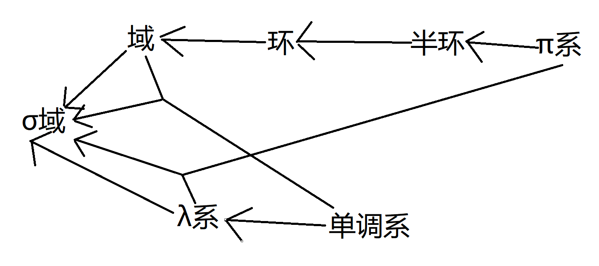

# 母函数

> 参考链接：
> 
> [母函数c++](https://blog.csdn.net/yu121380/article/details/79914529)

---

通过一个问题：

题目：有1克、2克、3克、4克的砝码各一 枚，能称出哪几种重量？

可以通过母函数$(x^0+x^1)*(x^0+x^2)*(x^0+x^3)*(x^0+x^4)$得到答案，指数的砝码的g数，系数是得到这个g数总共的方案数，多项式的长度对于其总数，其中包括0g。

更改题目：

输入砝码个数以及质量，质量不重复，输出目标方案的数量以及有哪些方法

例如：

  用1g、2g、3g的砝码称出10g的方案数以及方案（砝码个数不做限制）

```cpp
#include <iostream>
#include <cstring>
#include <cstdlib>
using namespace std;
#include <vector>

/*
输入砝码个数以及质量，质量不重复，输出目标方案的数量以及有哪些方法
例如：
    用1g、2g、3g的砝码称出10g的方案数以及方案（砝码个数不做限制）
使用母函数
 */

#define max_pol 100 //最大多项式个数
#define max_num 100 //最大砝码个数

int main()
{
    int w_num[max_num];              //砝码个数
    int pol[max_pol], temp[max_pol]; //多项式以及临时存储，pol存的数是系数，下标是指数
    int num, target;                 //砝码数量和目标大小
    cout << "砝码个数:";
    cin >> num;
    vector<vector<vector<int>>> goucheng(max_pol); //每个项的构成，是三个嵌套的vector
    cout << "砝码质量:";
    for (int i = 1; i <= num; i++)
    {
        cin >> w_num[i];
    }
    cout << "目标质量:";
    cin >> target;
    memset(pol, 0, sizeof(pol));                                    //置零
    for (int i = 0, _temp = 0; i <= target; _temp++, i += w_num[1]) //初始化第一个多项式，将有的地方系数置一
    {
        pol[i] = 1;                   //初始化系数为一
        vector<int> tempV(num + 1);   //临时容器用来存储项的构成，这里是最小容器
        tempV[1] += _temp;            //存入构成，这里存入w_num[1]的个数
        goucheng[i].push_back(tempV); //存入上一级容器，就是中等容器
        if (i == target)              //等于目标质量则输出
        {
            for (vector<vector<int>>::iterator it = goucheng[i].begin(); it != goucheng[i].end(); it++) //遍历第i个中间容器，即等于target的中等容器
            {
                for (int j = 1; j <= num; j++) //输出构成
                {
                    if ((*it)[j]) //不是零才输出
                    {
                        cout << (*it)[j] << "个" << w_num[j] << "g"
                             << " ";
                    }
                }
                cout << endl;
            }
        }
    }
    memset(temp, 0, sizeof(temp)); //临时空间置零
    for (int i = 2; i <= num; i++) //生成第i个多项式，从第二个开始
    {
        for (int j = 0; j <= target; j++) //遍历pol多项式的每一项
        {
            for (int k = 0, _temp = 0; k + j <= target; _temp++, k += w_num[i]) //遍历第i个多项式的每一项
            {
                temp[k + j] += pol[j]; //幂运算
                if (k != 0)            //为第一项（即x^0项）时不输出
                {
                    if (k + j == target) //当幂运算结果等于目标时输出
                    {
                        for (vector<vector<int>>::iterator it = goucheng[j].begin(); it != goucheng[j].end(); it++) //遍历中等容器
                        {
                            if (!(*it)[i])
                            {
                                for (int l = 1; l <= num; l++) //最小容器的每一个值
                                {
                                    if ((*it)[l]) //不是零才输出
                                    {
                                        cout << (*it)[l] << "个" << w_num[l] << "g"
                                             << " ";
                                    }
                                }
                                //输出另一个数
                                cout << _temp << "个" << w_num[i] << "g"
                                     << " ";
                                cout << endl;
                            }
                        }
                    }
                    for (vector<vector<int>>::iterator it = goucheng[j].begin(); it != goucheng[j].end(); it++) //更改构成项
                    {
                        vector<int> tempV(*it);
                        tempV[i] += _temp;
                        int flag = 1;
                        for (vector<vector<int>>::iterator it = goucheng[k + j].begin(); it != goucheng[k + j].end(); it++) //去重
                        {
                            int count = 0;
                            for (int l = 1; l <= num; l++) //最小容器的每一个值
                            {
                                if ((*it)[l] == tempV[l])
                                {
                                    count++;
                                }
                                else
                                {
                                    break;
                                }
                            }
                            if (count == num)
                            {
                                flag = 0;
                            }
                        }
                        if (flag)
                        {
                            goucheng[k + j].push_back(tempV);
                        }
                    }
                }
            }
        }
        for (int j = 0; j <= target; j++) //将临时转到多项式上，临时清空准备下一次
        {
            pol[j] = temp[j];
            temp[j] = 0;
        }
    }
    cout << pol[target] << endl;
    system("pause");
    return 0;
}
```

# 集合

> 参考链接及书籍：
> 
> [测度论与概率论基础-程士宏](.\books\测度论与概率论基础-程士宏.pdf)
> 
> [集合中的上极限与下极限](https://zhuanlan.zhihu.com/p/116829467)
> 
> [集合论](https://zhuanlan.zhihu.com/p/111137112)
> 
> [概率论基础-01: 集合类](https://zhuanlan.zhihu.com/p/133362813) :thumbsup:

------

## 1.集合的并、交运算

> **定义1.1.1：**
> 
> 设$D$是非空集合，对$D$中所有元素$\alpha$,都有一个子标集$A_\alpha$与之对应，则这些指标集组成的集合称为以$D$为指标集的集族，记作$\{A_\alpha|\alpha\in D\}$，简称$\{A_\alpha\}$。

例：若$D$为自然数集，则存在$\{A_\alpha\}$为集列$(A_1,A_2,\cdots,A_n,\cdots)$。当$D$为线性序集时，称为集列或集合列。

> **定义1.1.2：**
> 
> 对于集族$\{A_\alpha\}$，若存在$\alpha$，$such\ that(s.t.)\ x\in A_\alpha$，则称
> 
> $$
> x\in\bigcup_{\alpha\in D}A_\alpha
> $$
> 
> 即
> 
> $$
> \bigcup_{\alpha\in D}A_\alpha=\{x|\exist\alpha\in D,x\in A_\alpha\}
> $$
> 
> 若任意$\alpha$，满足$x\in A_\alpha$，则称
> 
> $$
> x\in\bigcap_{\alpha\in D}A_\alpha
> $$
> 
> 即
> 
> $$
> \bigcap_{\alpha\in D}A_\alpha=\{x|\forall\alpha\in D,x\in A_\alpha\}
> $$

根据定义1.1.2，有以下结论：

> **定理1.1.1：**
> 
> 对于集族$A_n$和集合$B$，有：
> 
> （1）若$\forall\alpha\in D$，有$B\subset A_\alpha$，则
> 
> $$
> B\subset\bigcap_{\alpha\in D}A_\alpha
> $$
> 
> （2）若$\forall\alpha\in D$，有$A_\alpha\subset B$，则
> 
> $$
> \bigcup_{\alpha\in D}A_\alpha \subset B
> $$

**证明：**

（1）若$x\in B$，则$\forall\alpha\in D$，$x\in A_\alpha$，由无穷交的定义，$x\in\underset{\alpha\in D}{\bigcap}A_\alpha$，得证。

（2）若$x\in\underset{\alpha\in D}{\bigcup}A_\alpha$，由无穷并的定义，$\exist\alpha$，$s.t.\ x\in A_\alpha$，由$A_\alpha\subset B$，得$x\in B$，得证。

由以上的可以看出$\bigcap$可以看成是$\forall$（任意），$\bigcup$可以看成是$\exist$（存在）。

> **定理1.1.2：**
> 
> 对于一列集合$A_n$和集合$B$，
> 
> $$
> \begin{aligned}
&(1)B\cap(\bigcup_{n=1}^{\infty}A_n)=\bigcup_{n=1}^{\infty}(A_n\cap B),B\cup(\bigcap_{n=1}^{\infty}A_n)=\bigcap_{n=1}^{\infty}(A_n\cup B)\\
&(2)B\cap(\bigcap_{n=1}^{\infty}A_n)=\bigcap_{n=1}^{\infty}(A_n\cap B),B\cup(\bigcup_{n=1}^{\infty}A_n)=\bigcup_{n=1}^{\infty}(A_n\cup B)
\end{aligned}
> $$

**证明：**

（1）若$x\in B\cap(\underset{n=1}{\overset{\infty}{\bigcup}}A_n)$，则$x\in B$且$x\in\underset{n=1}{\overset{\infty}{\bigcup}}A_n$，则$\exist n,x\in A_n$，故$x\in A_n\cap B$，由此$x\in\underset{n=1}{\overset{\infty}{\bigcup}}(A_n\cap B)$，从而$B\cap(\underset{n=1}{\overset{\infty}{\bigcup}}A_n)\subset\underset{n=1}{\overset{\infty}{\bigcup}}(A_n\cap B)$。

若$x\in\underset{n=1}{\overset{\infty}{\bigcup}}(A_n\cap B)$，则$\exist n，s.t.\ x\in A_n\cap B$，从而$x\in A_n$且$x\in B$，由此$x\in B\cap(\underset{n=1}{\overset{\infty}{\bigcup}}A_n)$，由此$\underset{n=1}{\overset{\infty}{\bigcup}}(A_n\cap B)\subset B\cap(\underset{n=1}{\overset{\infty}{\bigcup}}A_n)$。

综上，$B\cap(\underset{n=1}{\overset{\infty}{\bigcup}}A_n)=\underset{n=1}{\overset{\infty}{\bigcup}}(A_n\cap B)$成立。

（2）若$x\in B\cap(\underset{n=1}{\overset{\infty}{\bigcap}}A_n)$，则$x\in B$且$x\in\underset{n=1}{\overset{\infty}{\bigcap}}A_n$，从而$\forall n,s.t.\ x\in A_n\cap B$，因此$x\in\underset{n=1}{\overset{\infty}{\bigcap}}(A_n\cap B),B\cap(\underset{n=1}{\overset{\infty}{\bigcap}}A_n)\subset\underset{n=1}{\overset{\infty}{\bigcap}}(A_n\cap B)$。

若$x\in\underset{n=1}{\overset{\infty}{\bigcap}}(A_n\cap B)$，则$\forall n,s.t.\ x\in A_n\cap B$，因此$x\in\underset{n=1}{\overset{\infty}{\bigcap}}A_n$，从而$x\in B\cap(\underset{n=1}{\overset{\infty}{\bigcap}}A_n),\underset{n=1}{\overset{\infty}{\bigcap}}(A_n\cap B)\subset B\cap(\underset{n=1}{\overset{\infty}{\bigcap}}A_n)$。

综上，$B\cap(\underset{n=1}{\overset{\infty}{\bigcap}}A_n)=\underset{n=1}{\overset{\infty}{\bigcap}}(A_n\cap B)$成立。

> **定理1.1.3：**
> 
> 对于集列$A_n$和$B_n$，有
> 
> $$
> (\bigcup_{m=1}^{\infty}A_m)\cap(\bigcup_{n=1}^{\infty}B_n)=\bigcup_{m,n>1}A_m\cap B_n
> $$
> 
> $$
> (\bigcap_{m=1}^{\infty}A_m)\cup(\bigcap_{n=1}^{\infty}B_n)=\bigcap_{m,n>1}A_m\cup B_n
> $$

## 2.集合的差、补运算

> **定义1.2.1：**
> 
> 对于集合$A，B$属于集合A而不属于集合$B$的元素称为$A$减$B$的差集，记作$A\setminus B=\{x\in A且x\notin B\}$；当$B\subset A$时，则$A\setminus B$也记作$C_AB$；当我们讨论的集合都是$X$的子集时，称$X$为全集，$C_XB$一般记作$B^c$，称作$B$的补集。

注：以下讨论中，一般只使用$A\setminus B$与$B^c$两种符号，$C_AB$一般不使用，因此任何情况下都可以用$A\setminus B$代替；此外，$A\setminus B$在有些地方也记作$A-B$。

> **定理1.2.1：**
> 
> 设$S$是全集，集合$A\subset S$，则有：
> 
> $$
> \begin{aligned}
&(1)A\cap A^c=\varnothing,A\cup A^c=S\\
&(2)若x\in S,则x\notin A\Leftrightarrow x\in A^c,x\in A\Leftrightarrow x\notin A^c\\
&(3)(A^c)^c=A
\end{aligned}
> $$

**证明：**

（1）若$\exists x\in A\cap A^c$，则$x\in A$且$x\in A^c$，由此得出$x\notin A$，矛盾，从而得到$A\cap A^c=\varnothing$。显然$A\cup A^c\subset S$，而$\forall x\in S$，若$x\notin A$，则有$x\in\{x|x\in S且x\notin A\}=A^c$，故$S\subset A\cup A^c$，综上$A\cup A^c=S$。

（2）若$x\notin A$，由$A^c$的定义得，$x\in A^c$，故$\Rightarrow$成立，同理$\Leftarrow$也成立。

（3）若$x\in S$，则$x\in A\Leftrightarrow x\notin A^c\Leftrightarrow x\in(A^c)^c$，因此得证。

> **定理1.2.2：**
> 
> 若集合$A,B\subset S$，则有
> 
> $$
> \begin{aligned}
&(1)A\subset B\Leftrightarrow B^c\subset A^c\\
&(2)A\setminus B=A\cap B^c
\end{aligned}
> $$

**证明：**

（1）若$\forall x\in A$，有$x\in B$，取逆否命题：若$x\notin B(x\in B^c)$，有$x\notin A(x\in A^c)$，可得到$A\subset B\Leftrightarrow B^c\subset A^c$。

（2）若$x\in A\setminus B$，则$x\in A且x\notin B$，由定理5的（2）可知$x\notin B\Leftrightarrow x\in B^c$，得证$A\setminus B\sub A\cap B^c$。

若$x\in A\cap B^c$，则$x\in A且x\in B^c$，同理可的$x\in B^c\Leftrightarrow x\notin B$，可得$A\cap B^c\subset A\setminus B$。

综上，$A\setminus B=A\cap B^c$。

> **定理1.2.3：**
> 
> $$
> (A\setminus B)\cap C=A\cap C\setminus B\cap C,(A\setminus B)\setminus C=A\setminus(B\cup C)
> $$

**证明：**

若$x\in(A\setminus B)\cap C$，则$x\in C且x\in A$，故$x\in A\cap C$，另外$x\notin B$，因此$x\notin B\cap C$，故$(A\setminus B)\cap C\subset A\cap C\setminus B\cap C$；若$x\in A\cap C\setminus B\cap C$，则$x\in A$，且$x\in C$，但$x\notin B\cap C$，因为$x\in C$，所以$x\notin B$，因此$A\cap C\setminus B\cap C\subset(A\setminus B)\cap C$。

若$x\in(A\setminus B)\setminus C$，则$x\in A,x\notin B,x\notin C$，于是$x\notin B\cup C$，因此$(A\setminus B)\setminus C\subset A\setminus(B\cup C)$。若$x\in A\setminus(B\cup C)$，则$x\in A,x\notin B\cup C$，则$x\notin B,x\notin C$，因此$A\setminus(B\cup C)\subset(A\setminus B)\setminus C$。

> **定理1.2.4：(De Morgan公式)**
> 
> 若集合$A,B\subset S$，则有$(A\cup B)^c=A^c\cap B^c$，$(A\cap B)^c=A^c\cup B^c$

**证明：**

若$x\in(A\cup B)^c$，则$x\notin A\cup B$，故$x\notin A$且$x\notin B$，故$x\in A^c$且$x\in B^c$，得$(A\cup B)^c\subset A^c\cap B^c$。

同上可证$A^c\cap B^c\subset(A\cup B)^c$，综合可得$(A\cup B)^c=A^c\cap B^c$

若$(A\cap B)^c$，则$x\notin A\cap B$，故$x\notin A$或$x\notin B$，故$x\in A^c$或$x\in B^c$，得$(A\cap B)^c\subset A^c\cup B^c$

同上可证$A^c\cup B^c\subset(A\cap B)^c$，综合可得$(A\cap B)^c=A^c\cup B^c$

> **定理1.2.5：**
> 
> 设$\{A_\alpha\}$为指标集族，$S$为全集，则
> 
> $$
> (\bigcup_{\alpha\in D}A_\alpha)^c=\bigcap_{a\in\alpha}A_\alpha^c\\
(\bigcap_{\alpha\in D}A_\alpha)^c=\bigcup_{a\in D}A_\alpha^c
> $$

> **定理1.2.6：**
> 
> $$
> A\setminus(\bigcup_{\alpha\in D}A_\alpha)=\bigcap_{\alpha\in D}A\setminus A_\alpha\\
A\setminus(\bigcap_{\alpha\in D}A_\alpha)=\bigcup_{\alpha\in D}A\setminus A_\alpha
> $$

**证明：**

首先，$A\setminus A_\alpha=A\cap(A\setminus A_\alpha)=(A\cap A)\setminus(A\cap A_\alpha)=A\setminus(A\cap A_\alpha)$，将$(\bigcup_{\alpha\in D}A_\alpha)$看成一个整体可得

$$
A\setminus(\bigcup_{\alpha\in D}A_\alpha)
=A\setminus(\bigcup_{\alpha\in D}A_\alpha\cap A)
\xrightarrow{定理1.1.2}
A\setminus[\bigcup_{\alpha\in D}(A_\alpha\cap A)]\\
A\setminus(\bigcap_{\alpha\in D}A_\alpha)
=A\setminus(\bigcap_{\alpha\in D}A_\alpha\cap A)
\xrightarrow{定理1.1.2}
A\setminus[\bigcap_{\alpha\in D}(A_\alpha\cap A)]
$$

把A看做全集

$$
A\setminus[\bigcup_{\alpha\in D}(A_\alpha\cap A)]
\xrightarrow{定理1.2.3}A\cap[\bigcup_{\alpha\in D}(A_\alpha\cap A)]^c
\xrightarrow{定理1.2.6}\bigcap_{\alpha\in D}A_\alpha^c
=\bigcap_{\alpha\in D}A\setminus A_\alpha
$$

> **定义1.2.2：**
> 
> 对于集合$A,B$，$(A\setminus B)\cup(B\setminus A)$称为它们的对称差，记作$A\triangle B$。

> **定理1.2.7：**
> 
> （1）$A\triangle B=(A\cup B)\setminus (A\cap B)=(A\cap B^c)\cup(B\cap A^c)=A^c\triangle B^c$
> 
> （2）$A\triangle B=\Phi\Leftrightarrow A=B$
> 
> （3）$A\triangle B=B\triangle A$
> 
> （2）$(A\triangle B)\triangle C=A\triangle(B\triangle C)$

> **定理1.2.8：**
> 
> 若$B\subset A$，则$A\setminus B$也称为$A$和$B$的真差

## 3.集列的极限

> **定义1.3.1：**
> 
> 对于集列${A_n}$，若$\forall i$，都有$A_i\subset A_{i+1}$，则称${A_n}$是单调递增的集列；若$\forall i$，都有$A_{i+1}\subset A_i$，则称${A_n}$是单调递减的集列。
> 
> 设一个集列$\{A_n:n=1,2,\cdots,\}$，如果满足$A_n\subset A_n+1,\forall n\in \mathbb{N^+}$就称为非减的，记作$A_n\uparrow$，将无穷多个$A_n$并在一起的集合$\underset{n=1}{\overset{\infty}{\bigcup}}A_n$，称为集列$A_n$的极限，记作$\lim\limits_{n\rightarrow\infty}A_n$。
> 
> 同理非增集合列用简记为$A_n\downarrow$，极限$\lim\limits_{n\rightarrow\infty}A_n:=\underset{n=1}{\overset{\infty}{\bigcap}}A_n$。

非增, 非减的集列就统称为单调集合列。我们已经知道了，单调集合列的极限是如何定义的。现在，我们的任务就转为，给一个一般的集合列，如何来说它的极限是存在的。

> **定义1.3.2：**
> 
> 对于集列${A_n}$，称
> 
> $$
> \bigcap_{n=1}^{\infty}\bigcup_{j=n}^{\infty}A_j
> $$
> 
> 为集列${A_n}$的上极限，记作
> 
> $$
> \overline{\lim_{n\rightarrow\infty}}A_n或\limsup\limits_{n\rightarrow\infty}A_n
> $$
> 
> 称
> 
> $$
> \bigcup_{n=1}^{\infty}\bigcap_{j=n}^{\infty}A_j
> $$
> 
> 为集列${A_n}$的下极限，记作
> 
> $$
> \underset{n\rightarrow\infty}{\underline{\lim}}A_n
或\liminf\limits_{n\rightarrow\infty}A_n
> $$

对于$\underset{n=1}{\overset{\infty}{\bigcap}}\underset{j=n}{\overset{\infty}{\bigcup}}A_j$中的$\underset{j=n}{\overset{\infty}{\bigcup}}A_j$随着$j$的初始值$n$不断增大$\underset{j=n}{\overset{\infty}{\bigcup}}A_j$也是非增（$\underset{j=n}{\overset{\infty}{\bigcup}}A_j\ge\underset{j=n+1}{\overset{\infty}{\bigcup}}A_j$）的，可以将$\underset{j=n}{\overset{\infty}{\bigcup}}A_j$看做是一个非增的集列，对于非增集列将他们并起来就可以得到他的极限，于是我们就得到$\lim\limits_{n\rightarrow\infty}\underset{j=n}{\overset{\infty}{\bigcup}}A_j=\underset{n=1}{\overset{\infty}{\bigcap}}\underset{j=n}{\overset{\infty}{\bigcup}}A_j:=\limsup\limits_{n\rightarrow\infty}A_n$，将上述式子称作上极限；对于$\underset{n=1}{\overset{\infty}{\bigcup}}\underset{j=n}{\overset{\infty}{\bigcap}}A_j$中的$\underset{j=n}{\overset{\infty}{\bigcap}}A_j$随着$j$的初始值$n$不断增大$\underset{j=n}{\overset{\infty}{\bigcap}}A_j$也是非减（$\underset{j=n}{\overset{\infty}{\bigcap}}A_j\le\underset{j=n+1}{\overset{\infty}{\bigcap}}A_j$）的，可以将$\underset{j=n}{\overset{\infty}{\bigcap}}A_j$看做是一个非减的集列，同理可得$\lim\limits_{n\rightarrow\infty}\underset{j=n}{\overset{\infty}{\bigcap}}A_j=\underset{n=1}{\overset{\infty}{\bigcup}}\underset{j=n}{\overset{\infty}{\bigcap}}A_j:=\liminf\limits_{n\rightarrow\infty}A_n$，将上述式子称作下极限。


通过以下例子来理解：

存在以下集列$\{A_n\}_{n=1}^\infty$：

$$
A_1=\{1,a\}\\
A_2=\{0,b\}\\
A_3=\{1,b\}\\
A_4=\{0,b\}\\
A5=\{1,b\}\\
\cdots
$$

观察上极限$\underset{n=1}{\overset{\infty}{\bigcap}}\underset{k=n}{\overset{\infty}{\bigcup}}A_k$和下极限$\underset{n=1}{\overset{\infty}{\bigcup}}\underset{k=n}{\overset{\infty}{\bigcap}}A_k$的情况。

**上极限**

根据公式$[上极限]\underset{n=1}{\overset{\infty}{\bigcap}}\underset{k=n}{\overset{\infty}{\bigcup}}A_k$是对于$A_k$先并后交。先观察$\underset{k=n}{\overset{\infty}{\bigcup}}A_k$：当$n=1$时，可以将$\overset{\infty}{\underset{k=n=1}{\bigcup}}A_k$近似看做所有集合的并集（简记$N_1=\{0,1,a,b\}$），那么$N_1$中必然包含所有的样本点；当$n=2$时，$\overset{\infty}{\underset{k=n=2}{\bigcup}}A_k$，可以看做除去$A_1$的所有集合的并集（简记$N_2=\{0,1,b\}$）。

当$N_1$与$N_2$取交集时，$A_1$就可以不再考虑，如果$a$仅属于$A_1$的话，那么$A_1\bigcap A_2$中就不再包含$a$。以此类推，在后面的$A_3、A_4\cdots$，若$a$只属于有限个$A_k$，那么在取上极限的过程中会被抛弃，所以在本列中上极限为$\{0,1,b\}$（$a$只在$A_1$中存在，所以早就被踢出去了）。

所以上极限可以理解成为**在无穷个**$A_j$**集合中都存在的元素的集合**。那么$\{A_n\}$的上极限和取交集有什么区别？通过这个列子就可以看出，对$\{A_n\}$取交集及$\overset{\infty}{\underset{n=1}{\bigcap}}A_n$会取到空集，因为没有一个元素是所有集合都有的。区别就在于上极限中的元素$\omega$只需要属于无穷多个集合即可，不需要每个集合里都有。

因此上极限也可以这样表述：

$$
\limsup\limits_{x\rightarrow\infty}A_n=\{\omega|\omega属于无穷多个A_n\}
$$

**下极限**

根据公式$[下极限]\underset{n=1}{\overset{\infty}{\bigcup}}\underset{k=n}{\overset{\infty}{\bigcap}}A_k$是对于$A_k$先交后并。先观察$\underset{k=n}{\overset{\infty}{\bigcap}}A_k$：当$n=1$时，可以将$\overset{\infty}{\underset{k=n=1}{\bigcap}}A_k$近似看做所有集合的交集（简记$M_1=\varnothing$）；当$n=2$时，$\overset{\infty}{\underset{k=n=2}{\bigcap}}A_k$，可以看做除去$A_1$的所有集合的交集（简记$M_2=\{b\}$），最终下极限为$\{b\}$。

此时发现下极限中没有元素$\{0,1\}$。其原因是：虽然它们存在于无数多个集合中，但同样的，也有无数个集合内没有元素$\{0\}$或$\{1\}$就涉及到了上极限和下极限的一个关键区别。

下极限中的元素也可以理解为**只在有限个集合里不存在**（比如改例子中的$\{b\}$，只不存在于$A_1$），可以看做下极限比上极限更加的严格，所以这也暗含了下极限的元素一定存在于无数多的集合中，因此下极限的元素一定存在于上极限中。

因此下极限也可以这样表述：

$$
\liminf\limits_{x\rightarrow \infty}A_n=\{\omega|\omega至多不属于有限多个A_n\}
$$

> **定理1.3.1：**
> 
> 对于集列${A_n}$，
> 
> $$
> \begin{aligned}
&(1)x\in\overline{\lim\limits_{n\rightarrow\infty}}A_n\Leftrightarrow\forall m，存在n\ge m，使得x\in A_n\\
&(2)x\in\underset{n\rightarrow\infty}{\underline{\lim}}A_n\Leftrightarrow\exists m，当n\ge m时，总有x\in A_n
\end{aligned}
> $$

**证明：**

（1）若$x\in\overline{\lim\limits_{n\rightarrow\infty}}A_n$，则$x\in\underset{n=1}{\overset{\infty}{\bigcap}}\underset{j=n}{\overset{\infty}{\bigcup}}A_j$，则$\forall m$，都有$x\in\underset{j=m}{\overset{\infty}{\bigcup}}A_j$（因为$x$属于交集$\underset{n=1}{\overset{\infty}{\bigcap}}$，所以在后面的$\underset{j=n}{\overset{\infty}{\bigcup}}A_j$中必定含有$x$，所以$A_j$在大于等于$m$时必定会存在有$x\in A_j$），所以存在$n\ge m$时，有$x\in A_n$；若存在$n\ge m$，使得$x\in A_n$，则意味着$x\in\overset{\infty}{\underset{j=m}{\bigcup}}A_j$（因为在$\overset{\infty}{\underset{j=m}{\bigcup}}A_j$中也包含$A_n$），对于任意的$m$都成立。所以$x\in\underset{n=1}{\overset{\infty}{\bigcap}}\underset{j=n}{\overset{\infty}{\bigcup}}A_j=x\in\overline{\lim\limits_{n\rightarrow\infty}}A_n$。

（2）

若$x\in\underset{n\rightarrow\infty}{\underline{\lim}}A_n$，则$x\in\underset{n=1}{\overset{\infty}{\bigcup}}\underset{j=n}{\overset{\infty}{\bigcap}}A_j$，则$\exists m$，都有$x\in\underset{j=m}{\overset{\infty}{\bigcap}}A_j$，所以对$\forall n$当$n\ge m$时，$x\in A_n$(因为是交集，所有在大于$m$有集合中都含有元素$x$)任意$n\ge m$都有$x\in A_n$所以$x\in\underset{j=n}{\overset{\infty}{\bigcap}}A_j$ $m$有$x\in\underset{n=1}{\overset{\infty}{\bigcup}}\underset{j=n}{\overset{\infty}{\bigcap}}A_j=\underset{n\rightarrow\infty}{\underline{\lim}}A_n$

上极限描集中的元素是属于原集列的任意子列的元素，或属于集列中无限个集合的元素；下极限描述的元素是仅仅不属于集列中有限个集合的元素。因此，显然地有$\underset{n\rightarrow\infty}{\underline{\lim}}A_n\subset\overline{\lim\limits_{n\rightarrow\infty}}A_n$。

> **定义1.3.3:**
> 
> 若对于集列$\{A_n\}$，$\underset{n\rightarrow\infty}{\underline{\lim}}A_n=\overline{\lim\limits_{n\rightarrow\infty}}A_n$，则称它是收敛集列，定义它的极限为$\lim\limits_{n\rightarrow\infty}A_n=\underset{n\rightarrow\infty}{\underline{\lim}}A_n=\overline{\lim\limits_{n\rightarrow\infty}}A_n$

> **定理1.3.2：**
> 
> 若集列$\{A_n\}$单调递减，则$\lim\limits_{n\rightarrow\infty}A_n=\underset{n=1}{\overset{\infty}{\bigcap}}A_n$；若集列$\{A_n\}$单调递增，则$\lim\limits_{n\rightarrow\infty}A_n=\underset{n=1}{\overset{\infty}{\bigcup}}A_n$。

**证明：**

若集列$\{A_n\}$单调递减，则$\overline{\lim\limits_{n\rightarrow\infty}}A_n=\underset{n=1}{\overset{\infty}{\bigcap}}\underset{j=n}{\overset{\infty}{\bigcup}}A_j=\underset{n=1}{\overset{\infty}{\bigcap}}A_n$
$\big(\overline{\lim\limits_{n\rightarrow\infty}}A_n=\underset{n=1}{\overset{\infty}{\bigcap}}\underset{j=n}{\overset{\infty}{\bigcup}}A_j=\underset{n=1}{\overset{\infty}{\bigcap}}\underset{j=1}{\overset{\infty}{\bigcup}}A_j=\underset{j=1}{\overset{\infty}{\bigcup}}A\big)$。

若集列$\{A_n\}$单调递增，则

$\underset{n\rightarrow\infty}{\underline{\lim}}A_n=\underset{n=1}{\overset{\infty}{\bigcup}}\underset{j=n}{\overset{\infty}{\bigcap}}A_j=\underset{n=1}{\overset{\infty}{\bigcup}}A_n$
$\big(\underset{n\rightarrow\infty}{\underline{\lim}}A_n=\underset{n=1}{\overset{\infty}{\bigcup}}\underset{j=n}{\overset{\infty}{\bigcap}}A_j=\underset{n=1}{\overset{\infty}{\bigcup}}\underset{j=1}{\overset{\infty}{\bigcap}}A_j=\underset{n=1}{\overset{\infty}{\bigcap}}A_n\big)$。

# 集合系

> 参考链接：
> 
> [如何区分可数集，可列集，与有限集，无限集](https://www.zhihu.com/question/41216870)

------

集合组成的集合就是集合系。

> 给定一个集合$X$，由$X$中的一些子集合为元素构成的集合，就称为$X$上的集合系。

> 从集合系中任取两个元素$A$和$B$，后做集合运算（交，并，差等）之后，新生成的集合仍在这个集合系内，我们就称集合系对该运算是封闭的。

下面就将通过条件宽松的集合系入手，然后层层递进。

## 简单的集合系

### $\pi$系($\pi$-system)

> **定义2.1.1：**
> 
> $\pi$系：如果集合$X$系$\mathscr{P}$对**交运算是封闭**的，即
> 
> $$
> A,B\in\mathscr{P}\Rightarrow A\cap B\in\mathscr{P}
> $$
> 
> 则称$\mathscr{P}$为$\pi$系。

例：对于实数集$\mathbf{R}$有$\mathscr{P}_R\overset{def}{=}\{(-\infty,a\ ]:a\in\mathbf{R}\}$对有限交运算是封闭的，因而组成一个实数空间$\mathbf{R}$上的$\pi$系。


### 半环(Semi-ring)

> **定义2.1.2：**
> 
> 半环：在集合$X$上的一个$\pi$系（**非空，交封闭**）$\mathscr{L}$，对于任意的$A,B\in \mathscr{L}$且$\pmb{\lceil A\supset B\rfloor}$，存在**有限个两两不相交**的$\{C_k\in\mathscr{L},k=1,\cdots,n\}$使得$A\setminus B=\overset{n}{\underset{k=1}{\bigcup}}C_k$。

半环就是做完真差之后，得到的值能够被一个或多个不相交集合完全填充。


例：对任何$a,b\in \mathbf{R}$，记由左开右闭区间全体组成的集合系为$\mathscr{L}_R\overset{def}{=}\{(a,b\ ]:a,b\in \mathbf{R}\}$，它是$\mathbb{R}$上的半环。


### 环(Ring)

> **定义2.1.3:**
> 
> 环：**非空**集合系$\mathscr{R}$**并和差的运算是封闭**的，即：
> 
> $$
> A,B\in\mathscr{R}\Rightarrow A\cup B,A\setminus B\in\mathscr{R}
> $$

例：

$$
\mathscr{R}_R\overset{def}{=}\bigcup_{n=1}^{\infty}\{\bigcup_{k=1}^{n}(a_k,b_k]:a_k,b_k\in\mathbf{R}\}
$$

可以得出若集合$A\in\mathscr{R}_R，\exists n$使得$A\in\underset{k=1}{\overset{n}{\bigcup}}(a_k,b_k\ ]$其中$a_k,b_k\in\mathbf{R}$

### 域(field)

> **定义2.1.4：**
> 
> 域：满足以下条件的$\pi$系（**非空，交封闭**）$\mathscr{A}$称为域：
> 
> $$
> X\in\mathscr{A};A\in\mathscr{A}\Rightarrow A^c\in\mathscr{A}
> $$
> 
> 有些地方也把域叫代数（Algebra）。
> 也有这样定义的：
> 
> $$
> X\in\mathscr{A};A,B\in\mathscr{A}\Rightarrow A\setminus B\in\mathscr{A}
> $$

通过下面一个定义可以推出$A\setminus B= A\cap B^c$由上面一个定义可得$A\in\mathscr{A},B\in\mathscr{A},B^c\in\mathscr{A}$，因为交封闭可得，$A\bigcap B^c\in\mathscr{A}\Rightarrow A\setminus B\in A$。

对**交和补封闭**，且全集$X\in\mathscr{A}$

------

以上几种集合都是针对有限运算而言，对于建立测度来说是不够的。因此，还必须引进一些在可列运算下封闭的集合。

## 可列操作的集合系

> **有限集**就是能与$\{1,2,3,4,\cdots,n\}$($n$为任意自然数)建立双射的集合。简单的来概括就是一个一个的数总能全部数完的集合。比如$(1，2，3，4，\cdots，100)$就是有限集。
> 
> 不是有限集的集合就是**无限集**。
> 
> **可数集**就是无限但是能与自然数集建立双射的集合，又称**可列集**。可列集是最小的无穷集。
> 
> **不可列集**就是无限且又不能与自然数建立双射的集合。
> 
> 具体的：
> 
> 有限：我有10个苹果。
> 
> 可数:苹果多到数不完，但能1，2，3不停的数下去跟这些苹果对应，无限数下去可以数到每一个苹果。
> 不可数:苹果数不完，又杂杂乱乱，没法统一编号，就算无限编号，总会还有苹果没数上。

### 单调系(Monotone system)

> **定义2.2.1：**
> 
> 单调系：如果对于集合系$\mathscr{M}$中任何单调序列$\{A_n,n=1,2,\cdots\}$均有$\lim\limits_{n\rightarrow\infty}A_n\in\mathscr{M}$，则把$\mathscr{M}$叫做单调系。

这里运用到上面的集列的极限，对于**单调序列的极限是封闭**的（非增是$\cap$，非降是$\cup$是单调系还不具备“对于有限集合操作封闭”的概念，下一步，就要开始融合交，并，差，补的操作了。通过下面例子来体会单调系：

设基本空间$X$为$\{1,2,3\}$。令$\mathscr{M}_1=\{\varnothing,\{1\},\{2\},\{3\},X\}$，能看出$\mathscr{M}_1$是一个单调系。现在取$A_1=\{1\},A_2=\{2\}$，因此$A_1\cup2=\{1,2\}$,显然不在$\mathscr{M}_1$中，所以单调系不一定对有限并运算封闭。同样令$\mathscr{M}_2=\{\varnothing,\{1,2\},\{2,3\},X\}$，同样$\mathscr{M}_2$个单调系，取$A_1\{1,2\},A_2=\{2,3\}$。因此$A_1\cap A_2=\{2\}\notin\mathscr{M}_2$，单调系不一定对有限交闭。设基本空间$X$是$\{1,2\}$，令$mathscr{M}_3=\{\varnothing,\{1\},X\}$，取$A=\{1\}$所以$A^c=\{2\}\notin\mathscr{M}_3$，所以单调系对不一定对补集封闭。所以，单调系对于集合有限操作不一定封闭，那么我们要继续往限制更多的集合类探究。既能囊括集合列的极限，又能囊括一部分有限运算。

### $\lambda$系($\lambda$ system)

> **定义2.2.2：**
> 
> $\lambda$系：在基本空间$X$上满足以下三个条件的集合系$\mathscr{L}$称为$\lambda$：
> 
> $$
> \begin{aligned}
&X\in\mathscr{L}\\
&A,B\in\mathscr{L},A\supset B\Rightarrow A\setminus B\in\mathscr{L}\\
&A_n\in\mathscr{L},n=1,2,\cdots,A_n\uparrow\Rightarrow\bigcup_{n=1}^{\infty}A_n\in\mathscr{L}
\end{aligned}
> $$

全集$X$属于$\mathscr{L}$**真差是封闭**的$\Rightarrow$对补集封闭（因为全集$X\setminus A=A^c$）**非减集合列的极限封闭**。

### $\sigma$域($\sigma$ filed)

> **定义2.2.3：**
> 
> $\sigma$域：在基本空间$X$上满足以下三个条件的集合系$\mathscr{F}$称为$\sigma$域
> 
> $$
> \begin{aligned}
&X\in\mathscr{F}\\
&A\in\mathscr{F}\Rightarrow A^c\in\mathscr{F}\\
&A_n\in\mathscr{F},n=1,2,\cdots\Rightarrow\bigcup_{n=1}^{\infty}A_n\in\mathscr{F}
\end{aligned}
> $$

全集$X$属于$\mathscr{F}$，**补封闭**，**可列并封闭**。

有的书也把$\sigma$域叫做$\sigma$代数。有两个特殊的$\sigma$它们分别是$X$合最少的$\sigma$域$\{\varnothing,X\}$和$X$上含集合最的$\sigma$域$\mathscr{T}:=\{A:A\subset X\}$

## 各个集合系的关系

> **定理2.3.1**：
> 
> $\sigma$域一定是域；域一定是环；环一定是半环；半环一定是$\pi$系。

**证明：**

**1、$\sigma$域定是是域**

$\sigma$的定义：全集$X$集$\mathscr{F}$中可列并封闭。

域的定义：全集$X$在集合系$\mathscr{A}$，补封闭，交封闭。

对于前两个条件是一样，所以只需要证明可列并封闭$\Rightarrow$交封闭即可。

设$\mathscr{F}$是一个$\sigma$域，$\forall A_n\in\mathscr{F}$，通过德摩根定律可得$\underset{n=1}{\overset{\infty}{\bigcap}}A_n=\big(\underset{n=1}{\overset{\infty}{\bigcup}}A_n^c\big)^c\in\mathscr{F}$（通过补封闭可得$A_n\in\mathscr{F}\Rightarrow A_n^c\in\mathscr{F}$，然后通过可列并封闭以及补封闭可得$\underset{n=1}{\overset{\infty}{\bigcup}}A_n^c\in\mathscr{F}\Rightarrow\big(\underset{n=1}{\overset{\infty}{\bigcup}}A_n^c\big)^c\in\mathscr{F}$），所以可以得到$\sigma$代数对于可列交也是封闭的，可列交都封闭，有限交肯定也封闭。

**2、域一定是环**

域的定义：全集$X$在集合系$\mathscr{A}$中，补封闭，交封闭。

环的定义：并封闭，差封闭。

设$\mathscr{A}$是一个域，令$A,B\in\mathscr{A}$，使用德摩根定律可得$A\cup B=(A^c\cap B^c)^c\in\mathscr{A}$（因为补封闭所以$A^c\in\mathscr{A},B^c\in\mathscr{A}$，交封闭所以$A^c\cap B^c\in\mathscr{A}$补封闭所以$(A^c\cap B^c)^c\in\mathscr{A}$，得并封闭。

$A\setminus B=A\cap B^c\in\mathscr{A}$（通过补和交封闭可得），可以得到差封闭。

**3、环一定是半环**

环的定义：并封闭，差封闭。

半环的定义：交封闭，真差可以被有限个不相交的集合填充。

设$\mathscr{R}$是一个环，令$A,B\in\mathscr{R}$，有$A\cup B,A\setminus B,B\setminus A\in\mathscr{R}$，那么$A\cap B=(A\cup B)\setminus[(A\setminus B)\cup(B\setminus A)]\in\mathscr{R}$（通过并封闭，差封闭可得)，


可以得到交封闭。

若$A\supset B$，那么$\exists C\in\mathscr{R},s.t.C=A\setminus B\in\mathscr{R}$。

**4、半环一定是$\pi$系**

半环的定义：交封闭，真差可以被有限个不相交的集合填充。

$\pi$系的定义：交封闭

可以明显得出

> **定理2.3.2**：
> 
> $\sigma$域一定是$\lambda$系；$\lambda$系一定是单调系

**证明：**

**1、$\lambda$系定是单调系**

$\lambda$系的定义：真差是封闭，非减集合列的极限封闭。

单调系的定义：单调序列的极限是封闭。

在定义中已经有非减集合列的极限封闭，那么现在要看非增集合列的极限是否在集合系中。

任取集合类$\mathscr{L}$中非增序列$\{B_n\}_{n\in\mathbb{N}}$，因为全集$X$在集合系中，并且对真差封闭，所以可以得到补封闭，所以就可以得到$\{B_n^c\}$是*非减集合列*。所以$\underset{n=1}{\overset{\infty}{\bigcup}}B_n^c\in\mathscr{L}$，使用德摩根定律可得$\underset{n=1}{\overset{\infty}{\bigcup}}B_n^c=\big(\underset{n=1}{\overset{\infty}{\bigcap}}B_n\big)^c=\big(\limsup\limits_{n\rightarrow\infty}B_n\big)^c\in\mathscr{L}$，在通过差封闭可以得到$\limsup\limits_{n\rightarrow\infty}B_n\in\mathscr{L}$。所以可以得到$\lambda$系一定是单调系。

**2、$\sigma$域一定是$\lambda$系**

$\sigma$域的定义：全集$X$在集合系$\mathscr{F}$中，补封闭，可列并封闭。

$\lambda$系的定义：真差是封闭，非减集合列的极限封闭。

设$\mathscr{F}$是一个$\sigma$域，$\forall A_n\in\mathscr{F}$，通过德摩根定律$\underset{n=1}{\overset{\infty}{\bigcap}}A_n=\big(\underset{n=1}{\overset{\infty}{\bigcup}}A_n^c\big)^c\in\mathscr{F}$，通过$\sigma$域对于补封闭得到。所以$\sigma$域对于可列交也是封闭的。

由于$\sigma$域是域，域是环，环对真差封闭，通过上一个证明的证明三可以得出，所以$\sigma$域对真差封闭，所以$\sigma$域一定是$\lambda$系。

> **定理2.3.3：**
> 
> $X$上的集合系$\mathscr{F}_1$既是单调系，又是域时，则$\mathscr{F}_1$是一个$\sigma$域


> **定理2.3.4：**
> 
> $X$上的集合系$\mathscr{F}_2$是$\pi$系，又是$\lambda$系时，则$\mathscr{F}_2$是一个$\sigma$


