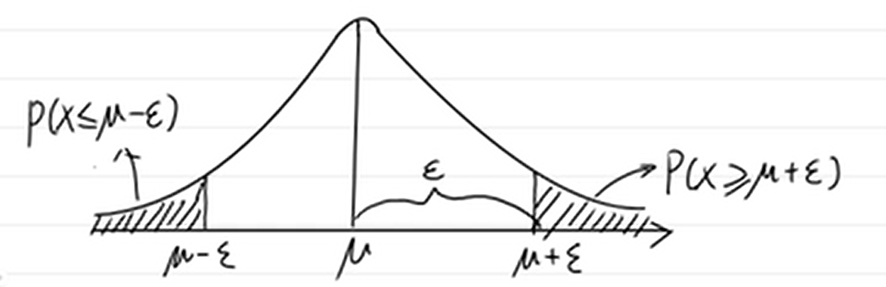

# 泛化能力证明

---

## 先导

### 样本期望和方差的无偏估计

假设 $X_1,X_2,X_3,....,X_n$ 是一个独立同分布( $i.i.d$ )随机变量序列，假设其均值 $\mu=\mathbb{E}[X]$ 及其方差 $\sigma^2=Var[X]$ 均存在。若采用如下估计量来估计 $\mu$ ，用 $\hat\mu$ 表示，同时 $\hat\mu$ 也是样本均值 $\bar{X}$ ：

$$
\begin{aligned}
\bar{X}&=\hat{\mu}=\frac{1}{N}\sum_{i=1}^{n}X_i\\
\end{aligned}
$$

> 无偏估计的定义：
> 
> $$
> \mathbb{E}[\theta]=\theta
> $$

样本均值期望满足无偏估计，**证明**如下：

*Proof:*

$$
\begin{aligned}
\mathbb{E}[\hat{\mu}]&=\mathbb{E}[\frac{1}{N}\sum_{i=1}^{N}X_i]\\
&=\frac{1}{N}\sum_{i=1}^{N}\underset{\mu}{\underbrace{\mathbb{E}[X_i]}}\\
&=\frac{1}{N}\cdot N\cdot\mu=\mu
\end{aligned}
$$

 $\square$ 

> 方差的定义： $Var:=\mathbb{E}[(Z-\mathbb{E}[Z])^2]$ 
> 
> 在总体方差中，设 $S^2$ 为其方差，表达式为：
> 
> $$
> S^2=\cfrac{1}{N}\sum_{i=1}^N(X_i-\bar{X})^2
> $$

对于 $\hat\mu$ 的方差如下：

$$
\begin{aligned}
Var(\hat\mu)&=Var[\frac{1}{N}\sum_{i=1}^{N}X_i]\\
&=\frac{1}{N^2}\sum_{i=1}^{N}\underset{\sigma^2}{\underbrace{Var(X_i)}}\\
&=\frac{1}{N^2}\cdot N\cdot \sigma^2\\
&=\frac{\sigma^2}{N}
\end{aligned}
$$

总体方差是有偏估计，**证明**如下：

*Proof:*

$$
\begin{aligned}
\mathbb{E}[\cfrac{1}{N}\sum_{i=1}^{N}(X_i-\bar{X})^2]&=\cfrac{1}{N}\mathbb{E}[\sum_{i=1}^{N}[(X_i-\mu)-(\bar{X}-\mu)]^2]\\
&=\cfrac{1}{N}\mathbb{E}[\sum_{i=1}^{N}(X_i-\mu)^2-2(\bar{X}-\mu)\sum_{i=1}^{N}(X_i-\mu)+N(\bar{X}-\mu)^2]\\
&\because\sum_{i=1}^{N}(X_i-\mu)=N(\bar{X}-\mu)\\
&=\cfrac{1}{N}\mathbb{E}[\sum_{i=1}^{N}(X_i-\mu)^2-N(\bar{X}-\mu)^2]\\
&\because\mathbb{E}[(X_i-\mu)^2]=Var(X_i)=\sigma^2\\
&\ \quad\mathbb{E}[(\bar{X}-\mu)^2]=Var(\bar{X})=Var(\hat\mu)=\cfrac{\sigma^2}{N}\\
&=\cfrac{1}{N}(N\sigma^2-N\cdot\cfrac{\sigma^2}{N})\\
&=\cfrac{(N-1)}{N}\sigma^2
\end{aligned}
$$

当对上式( $\cfrac{1}{N}\sum_{i=1}^{N}(X_i-\bar{X})^2$ )乘上 $\cfrac{N}{N-1}$ 后即可让其方差，达成无偏估计无偏方差为：

$$
S^2=\cfrac{1}{N-1}\sum_{i=1}^{N}(X_i-\bar{X})^2
$$

 $\square$ 

### 尾概率

那么 $\mu$ （期望）和 $\hat\mu$ （样本期望）之间大概差多少？

通常使用 $|\hat\mu-\mu|\ge\epsilon$ ， $\epsilon$ 是设置的一个阈值，当超过这个时则认为差距大，不超过时则认为不大，那么通过计算 $P(|\hat\mu-\mu|\ge\epsilon)$ 如果这个值很小则认为 $\hat\mu$ 是符合要求的， $P(|\hat\mu-\mu|\ge\epsilon)$ 就称为尾概率。

> 定义：若X是一个构成均值为 $\mu$ 的随机变量， $\epsilon$ 是一个常数：
> 
> - $P(X\ge\mu+\epsilon)$ 称为右尾概率（upper tail probability）
> - $P(X\le\mu-\epsilon)$ 称为左尾概率（lower tail probability）
> - $P(|X-\mu|\ge\epsilon)$ 称为双尾概率（two-sided tail probability）

### 损失函数

损失函数是用来度量模型一次预测的好坏，通常用 $L(Y,f(x))$ 来表示，常见的损失函数有：

- 0-1损失函数

$$
\begin{aligned}
L(Y,f(X))=\begin{cases}1,\quad Y\neq f(X) \\ 0,\quad Y=f(X) \end{cases}
\end{aligned}
$$

- 平方损失函数

$$
L(Y,f(X))=(Y-f(X))^2
$$

- 绝对值损失函数

$$
L(Y,f(X))=|Y-f(X)|
$$

- 对数似然损失函数

$$
L(Y,P(Y|X))=-lnP(Y|X)
$$

---

### 风险函数

风险函数则是损失函数的平均。

若是在训练样本集上的平均，则称为**经验风险**或**经验损失**（Empirical Risk/Loss），记作 $R_{emp}(f)$ 。给定训练集 $T=\{(x_1,y_1),(x_2,y_2),...,(x_n,y_n)\}$ ，则：

$$
R_{emp}(f)=\frac{1}{N}\sum_{i=1}^{N}L(y_i,f(x_i))
$$

若是在样本空间上的期望，相当于在全集中进行度量。则为**期望风险**或**期望损失**（Expected Risk/Loss），记作 $R_{exp}(f)$ 。模型的输入、输出 $(X,Y)$ 是随机变量，遵循联合分布 $P(X,Y)$ ，则：

$$
\begin{aligned}
R_{exp}(f)\ &=\ \mathbb{E}_p[L(Y,f(X))] \\
&= \int_{X\times Y}L(y,f(x))P(x,y)dxdy
\end{aligned}
$$

模型训练的终极目的是为了降低期望风险。但由于联合分布 $P(X,Y)$ 是未知的，所以期望风险只存在理论意义。

根据大数定律，当样本容量 $N$ 趋于无穷时，经验风险趋于期望风险。因此，在实际训练时，我们可以用经验风险去近似期望风险。针对样本容量大小，存在两种训练策略：经验风险最小(经验损失最小)策略和结构风险最小(**结构风险=经验风险+正则化项**)策略。正则化参考[2.LinearRegression.md](.\2.LinearRegression.md)中的L1和L2正则化。

$$
\begin{aligned}
R_{srm}(f)&=R_{emp}+\lambda J(f)\\
&=\frac{1}{N}\sum_{n=1}^{N}L(y,f(x,f))+\lambda J(f)
\end{aligned}
$$

当样本容量足够大时，经验风险最小策略就能保证较好的训练效果，即：

$$
\underset{f\in F}{min}R_{emp}(f)
$$

如果训练样本有限，经验风险最小策略就会产生“过拟合”，可在经验风险的基础上增加表示模型复杂度的正则化项（惩罚项），即结构风险最小策略（Structural Risk Minimization, SRM）:

$$
\underset{f\in F}{min}R_{srm}(f)=\underset{f\in F}{min}[R_{emp}(f)+\lambda J(f)]
$$

其中， $J(f)$ 表示模型复杂度，是定义在假设空间 $F$ 上的泛函， $f$ 越复杂， $J(f)$ 越大，比如在多项式函数空间，多项式系数的平方和可作为度量函数复杂度的指标。 $\lambda \ge 0$ 是正则化系数，用于权衡经验风险和模型复杂度，即用来控制正则化项（惩罚项）惩罚力度。
正则化方法符合奥卡姆剃刀原理：在所有可能的模型中，能够很好解释已有数据，且最简单的模型才是最好的模型。这样的模型泛化能力强。

------

## 霍夫丁不等式的证明

证明霍夫丁不等式，需要先证明马尔可夫不等式、切比雪夫不等式、切诺夫界和霍夫丁引理，才能够对霍夫丁不等式进行证明，这些不等式也叫集中不等式。

$$
\begin{aligned}
&马尔可夫不等式\\
\Rightarrow&切比雪夫不等式\\
\Rightarrow&切诺夫界\\
\Rightarrow&霍夫丁引理\\
\Rightarrow&霍夫丁不等式
\end{aligned}
$$

### 一、Markov’s Inequality（马尔可夫不等式）及证明

马尔可夫不等式把概率关联到数学期望，给出了随机变量的分布函数的一个宽泛但仍有用的上界。 

> 定理：令 $X$ 为非负随机变量，且假设 $E(X)$ 存在，则对任意的 $\epsilon>0$ 有
> 
> $$
> P\{X\ge \epsilon\}\le\frac{\mathbb{E}(X)}{\epsilon}
> $$

马尔可夫不等式是用来估计尾部事件的概率上界，一个直观的例子是：如果 $X$ 是工资，那么 $\mathbb{E}(X)$ 就是平均工资，假设 $\epsilon=n*\mathbb{E}(X)$ ，即平均工资的 $n$ 倍。那么根据马尔可夫不等式，不超过 $\frac{1}{n}$ 的人会有超过平均工资的 $n$ 倍的工资。

证明如下:

*Proof~1~:*

$$
\begin{aligned}
\mathbb{E}(X)&=\int_0^{+\infty}xf(x)dx\\
&=\int_0^\epsilon xf(x)dx+\int_\epsilon^{+\infty}xf(x)dx\\
&\ge\int_\epsilon^{+\infty}xf(x)dx\\
&\ge \epsilon\int_\epsilon^{+\infty}f(x)dx\\
&=\epsilon P\{X\ge \epsilon\}\\
\Rightarrow &P\{X\ge \epsilon\}\le \frac{\mathbb{E}(X)}{\epsilon}&
\end{aligned}
$$

*Proof~2~:*

$$
\begin{aligned}
P(X\ge \epsilon)&=\int_{X\ge \epsilon}p(x)dx\qquad(1)\\
&\le\int_{X\ge \epsilon}\frac{x}{\epsilon}p(x)dx\quad(2)\\
&=\frac{1}{\epsilon}\int_{X\ge \epsilon}xp(x)dx\\
&\le\frac{1}{\epsilon}\int_{0}^{+\infty}xp(x)dx\\
&=\frac{\mathbb{E}(X)}{\epsilon}
\end{aligned}
$$

由 $(1)$ 变到 $(2)$ 可由 $P(X\ge \epsilon)$ 中的 $X\ge \epsilon$ 得出，将 $\epsilon$ 移到右边得到 $\frac{X}{\epsilon}\ge1$ ，带入 $(1)$ 式可得 $(2)$ 式。

---

将该不等式推广到概率测度空间上：

> 设 $(\Omega,\mathscr{F},\mathbb{P})$ 为概率空间， $X$ 为非负实值随机变量，对任意 $\epsilon>0$ ，则有 $\mathbb{P}(w\in\Omega:X(w)\ge\epsilon)\le\cfrac{1}{\epsilon}\int_{\Omega}X(w)d\mathbb{P}$ 

*proof：*

[概率空间](.\0_1Extra.数学定义.md#probability) 

令阶梯函数

$$
S(w)=\begin{cases}\epsilon&,X(w)\ge\epsilon\\0&,X(w)<\epsilon\end{cases}
$$

显然有 $0\le S(w)\le X(w)$ ，

$$
\begin{aligned}
\mathbb{E}[X]
&=\int_{\Omega}X(w){\rm d}\mathbb{P}\\
&\ge\int_{\Omega}S(w){\rm d}\mathbb{P}\\
&=\underset{0}{\underbrace{\int_0^\epsilon S(w){\rm d}\mathbb{P}}}
+\underset{\epsilon\int_\epsilon^\infty{\rm d}\mathbb{P}}
{\underbrace{\int_\epsilon^\infty S(w){\rm d}\mathbb{P}}}\\
&=\epsilon\underset{\mathbb{P}(X\ge\epsilon)}
{\underbrace{\mathbb{P}(\{w\in\Omega:X(w)\ge\epsilon\}}})\\
&\Rightarrow\mathbb{E}[X]\ge\epsilon\mathbb{P}(X\ge\epsilon)\\
&\because\epsilon\gt0\\
&\therefore\cfrac{\mathbb{E}[X]}{\epsilon}\ge\mathbb{P}(X\ge\epsilon)
\end{aligned}
$$

 $\square$ 

### 二、Chebyshev’s Inequality（切比雪夫不等式）及证明

切比雪夫不等式是马尔可夫不等式的特殊情况，其不限定随机变量的范围，应用更广泛。

> 若任意随机变量 $(r.v)X$ 的期望和方差都存在，分别为 $E(X)$ 和 $Var(X)$ ，则有：
> 
> $$
> P\{|X-\mathbb{E}(X)|\ge \epsilon\}\le\frac{Var(X)}{\epsilon^2},\epsilon>0
> $$

*Proof~1~：*

任取 $\epsilon>0$ 

$$
\begin{aligned}
P\{|X-\mathbb{E}(X)|\ge\epsilon\}&=\textcolor{red}{P\{|X-\mathbb{E}(X)|^2\ge\epsilon^2\}}\\
&\textcolor{red}{\le\frac{\mathbb{E}\{|X-\mathbb{E}(X)|^2\}}{\epsilon^2}}\\
&=\frac{Var(X)}{\epsilon^2}
\end{aligned}
$$

 $\square$ 

红色部分使用的是马尔科夫不等式

*Proof~2~：*

使用和Markov不等式类似的证明方法，通过放缩的方式也可以获得这一结果

$$
\begin{aligned}
记D:|X-\mathbb{E}(X)|\ge\epsilon\\
P\{|X-\mathbb{E}(X)|\ge\epsilon\}&=\textcolor{red}{\int_{D}f(x)dx}\\
&\textcolor{red}{\le\int_D(\frac{|X-E(X)|}{\epsilon})^2f(x)dx}\\
&=\frac{1}{\epsilon^2}\int_D(X-\mathbb{E}(X))^2f(x)dx\\
&\le\frac{1}{\epsilon^2}\int_{-\infty}^{+\infty}(X-\mathbb{E}(X))^2f(x)dx\\
&=\frac{1}{\epsilon^2}Var(X)
\end{aligned}
$$

 $\square$ 

红色部分是 $|X-\mathbb{E}(X)|\ge\epsilon$ 得到的 $\frac{|X-\mathbb{E}(X)|}{\epsilon}\ge1$ 代入

### 三、Chernoff’s bound（切诺夫界）证明

在实际应用中，由于Markov不等式和Chebyshev不等式仅用到了随机变量的一阶和二阶矩（期望和方差）特征，通常得到的界较为宽松。我们希望能够找到一个更为紧确的界。

上面的切比雪夫不等式使用的是 $(X-\mathbb{E}[X])^2$ 那么也可以使用 $(X-\mathbb{E}[X])^k$ ，k为任意常数，k可能是奇数使用使用 $|X-\mathbb{E}[X]|^k$ ,再使用马尔科夫不等式得到 $\mathbb{P}(|X-\mathbb{E}[X]|\ge\epsilon)\le\cfrac{\mathbb{E}[|X-\mathbb{E}|^k]}{\epsilon^k}$ ，在这些上界中可以得到一个更小的，更紧的上界，但是对于$k$的计算也较为复杂。我们需要一个界它足够的紧，又比较方便计算，那么切诺夫界正好就满足了这两个要求，它的右侧是矩母函数。

> 矩母函数：
> 
> 假设X为一个随机变量 $(r.v.)$ ，若存在 $h>0$ 使得对于任意 $\lambda\in[0,h],\mathbb{E}[e^{\lambda x}]$ 均存在，则称存在矩母函数（MGF），记作 $M_x(\lambda)$ ，定义式为：
> 
> $$
> M_x(\lambda):=\mathbb{E}[e^{\lambda x}]=
\begin{cases}
\sum_xe^{\lambda x}\cdot \underset{PMF}{\underbrace{P(x)}}&x:discrete(离散)\\
\int_xe^{\lambda x}\cdot \underset{PDF}{\underbrace{f(x)}}dx&x:continuous(连续)
\end{cases}\\
\begin{aligned}
&PDF:概率密度函数（probability density function），连续型\\
&PMF:概率质量函数（probability mass function), 离散型
\end{aligned}
> $$

为什么要使用矩母函数

**性质：**

> 对于随机变量 $X$ ， $a\le X\le b$ ，且 $E(X)=0$ ，则对于 $\forall\lambda\in R$ ：
> 
> $$
> \mathbb{E}[e^{\lambda X}]\le e^{\frac{\lambda^2(b-a)^2}{8}}
> $$

*Proof:*

霍夫丁引理的证明主要是使用了下凸函数的性质。对于凸函数 $f(x)$ ，有：

$$
f(x)\le f(a)+\frac{f(b)-f(a)}{b-a}(x-a),a\le x\le b
$$

------

## 泛化能力解释

### 泛化能力（generalization ability）

泛化能力表示学习方法学习到的模型对未知数据的预测能力，可以通过泛化误差来度量。理解为举一反三的能力。

### 泛化误差（generalization error）

泛化误差表示用学习到的模型对未知数据进行预测的误差，定义如下：（假设学到的模型为 $\hat{f}$  ，L为损失函数）

$$
\begin{aligned}
R_{exp}(f)\ &=\ \mathbb{E}_p[L(Y,\hat{f}(X))] \\
&= \int_{X\times Y}L(y,\hat{f}(x))P(x,y)dxdy
\end{aligned}
$$

泛化误差也就是所学模型的误差期望值（即期望风险），反映了学习方法的泛化能力。

### 泛化误差上界（generalization error bound）

学习方法的泛化能力分析往往是通过研究泛化误差的概率上界进行的，简称为泛化误差上界。泛化误差即期望误差，由于其只存在理论意义，只能从理论上寻找泛化误差的概率上界。

泛化误差上界性质如下：

> 1. **它是样本容量的函数，当样本容量增加时，泛化上界趋于0**（样本越多，泛化上界越小）
> 2. **它是假设空间容量（capacity）的函数，假设空间容量越大，模型就越难学，泛化误差上界就越大**（假设空间越大，泛化上界越大）

------

> 参考文章及视频：
> 
> [泛化误差上界的证明](https://blog.csdn.net/qq_43872529/article/details/104362791 "泛化误差上界的证明")
> 
> [泛化误差上界](https://blog.csdn.net/deepbodhi/article/details/119823871 "泛化误差上界")
> 
> [马尔可夫(Markov)不等式 ](https://www.cnblogs.com/yanghh/p/13291411.html "马尔可夫(Markov)不等式")
> 
> [尾概率估计方法](https://zhuanlan.zhihu.com/p/425562737)
> 
> [强化学习理论基础 Sound_of_wind的个人空间_bilibili【视频】](https://space.bilibili.com/2374895/channel/seriesdetail?sid=352698&ctype=0)
> 
> [集合论](https://zhuanlan.zhihu.com/p/102397463)
> 
> [如何通俗的理解矩母函数](https://zhuanlan.zhihu.com/p/148408669)
