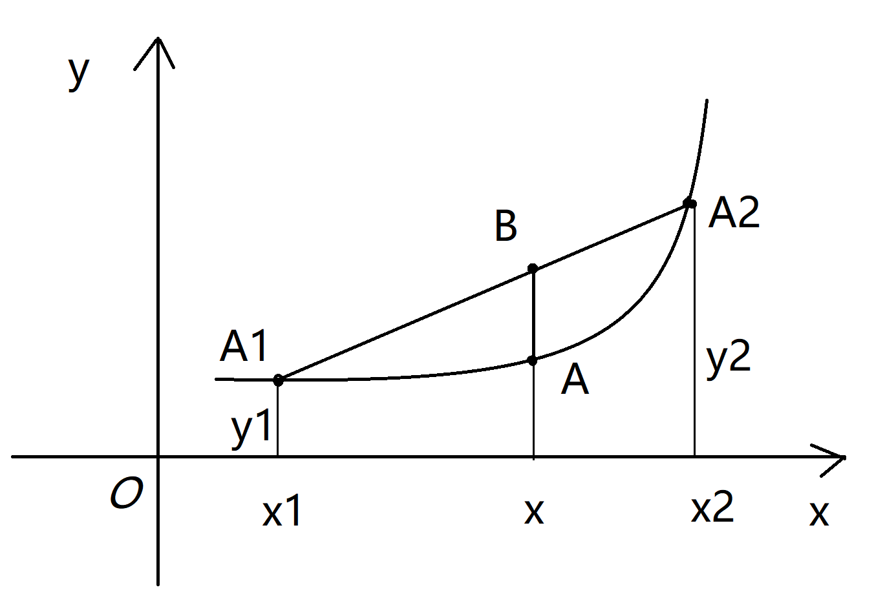

# 泛化能力证明

---

> 参考文章及视频：
> 
> [泛化误差上界的证明](https://blog.csdn.net/qq_43872529/article/details/104362791 "泛化误差上界的证明")
> 
> [泛化误差上界](https://blog.csdn.net/deepbodhi/article/details/119823871 "泛化误差上界")
> 
> [马尔可夫(Markov)不等式](https://www.cnblogs.com/yanghh/p/13291411.html "马尔可夫(Markov)不等式")
> 
> [尾概率估计方法](https://zhuanlan.zhihu.com/p/425562737)
> 
> [强化学习理论基础 Sound_of_wind的个人空间_bilibili【视频】](https://space.bilibili.com/2374895/channel/seriesdetail?sid=352698&ctype=0) :+1:
> 
> [集合论](https://zhuanlan.zhihu.com/p/102397463)
> 
> [如何通俗的理解矩母函数](https://zhuanlan.zhihu.com/p/148408669)
> 
> [concentration-slides (stanford.edu)](https://web.stanford.edu/class/cs229t/2017/Lectures/concentration-slides.pdf)

## 先导

### 期望和方差的定义和性质

> 期望的**定义**：
> 
> 离散型：
> 
> $$
> \mathbb{E}[X]=\sum_{i}^{n}x_ip_i
> $$
> 
> 连续型：
> 
> $$
> \mathbb{E}[X]=\int_{-\infty}^{+\infty}xf(x){\rm d}x
> $$
> 
> 也称为随机变量X的均值，记做 $\bar{X}$ 
> 
> 期望的**性质**：
> 
> $$
> \begin{aligned}
&\mathbb{E}[C]=C,C是常数\\
&\mathbb{E}[aX]=a\mathbb{E}[X],a是常数\\
&\mathbb{E}[aX+bY]=a\mathbb{E}[X]+b\mathbb{E}[Y]\\
&若X,Y相互独立，则\mathbb{E}[XY]=\mathbb{E}[X]\mathbb{E}[Y]
\end{aligned}
> $$

> 方差的**定义**：
> 
> $$
> D[X]=Var[X]:=\mathbb{E}[(X-\mathbb{E}[X])^2]
> $$
> 
> 离散型：
> 
> $$
> Var[X]=\sum_{i}^{n}(x_i-\mathbb{E}[X])^2p_i
> $$
> 
> 连续型：
> 
> $$
> Var[X]=\int_{-\infty}^{+\infty}(x-\mathbb{E}[X])^2f(x){\rm d}x
> $$
> 
> 方差的**性质**：
> 
> $$
> \begin{aligned}
&Var[C]=0,C是常数\\
&Var[CX]=C^2Var[X]\\
&Var[aX+bY]=a^2Var[X]+b^2Var[Y]+2ab\mathbb{E}[X-EX]\mathbb{E}[Y-EY]\\
&若X,Y相互独立，则Var[aX+bY]=a^2Var[X]+b^2Var[Y]\\
&Var[X+b]=Var[X]\\
&Var[aX+b]=a^2Var[X]\\
&Var[X]=\mathbb{E}[X^2]-\mathbb{E}^2[X]
\end{aligned}
> $$

### 样本期望和方差的无偏估计

假设 $X_1,X_2,X_3,....,X_n$ 是一个独立同分布( $i.i.d$ )随机变量序列，假设其均值 $\mu=\mathbb{E}[X]$ 及其方差 $\sigma^2=Var[X]$ 均存在。若采用如下估计量来估计 $\mu$ ，用 $\hat\mu$ 表示，同时 $\hat\mu$ 也是样本均值 $\bar{X}$ ：

$$
\begin{aligned}
\bar{X}&=\hat{\mu}=\frac{1}{N}\sum_{i=1}^{n}X_i\\
\end{aligned}
$$

> 无偏估计的**定义**：
> 
> $$
> \mathbb{E}[\theta]=\theta
> $$

样本均值期望满足无偏估计，**证明**如下：

*Proof:*

$$
\begin{aligned}
\mathbb{E}[\hat{\mu}]&=\mathbb{E}[\frac{1}{N}\sum_{i=1}^{N}X_i]\\
&=\frac{1}{N}\sum_{i=1}^{N}\underset{\mu}{\underbrace{\mathbb{E}[X_i]}}\\
&=\frac{1}{N}\cdot N\cdot\mu=\mu
\end{aligned}
$$

 $\square$ 

> 在总体方差中，设 $S^2$ 为其方差，表达式为：
> 
> $$
> S^2=\cfrac{1}{N}\sum_{i=1}^N(X_i-\bar{X})^2
> $$

对于 $\hat\mu$ 的方差如下：

$$
\begin{aligned}
Var(\hat\mu)&=Var[\frac{1}{N}\sum_{i=1}^{N}X_i]\\
&=\frac{1}{N^2}\sum_{i=1}^{N}\underset{\sigma^2}{\underbrace{Var(X_i)}}\\
&=\frac{1}{N^2}\cdot N\cdot \sigma^2\\
&=\frac{\sigma^2}{N}
\end{aligned}
$$

总体方差是有偏估计，**证明**如下：

*Proof:*

$$
\begin{aligned}
\mathbb{E}[\cfrac{1}{N}\sum_{i=1}^{N}(X_i-\bar{X})^2]&=\cfrac{1}{N}\mathbb{E}[\sum_{i=1}^{N}[(X_i-\mu)-(\bar{X}-\mu)]^2]\\
&=\cfrac{1}{N}\mathbb{E}[\sum_{i=1}^{N}(X_i-\mu)^2-2(\bar{X}-\mu)\sum_{i=1}^{N}(X_i-\mu)+N(\bar{X}-\mu)^2]\\
&\because\sum_{i=1}^{N}(X_i-\mu)=N(\bar{X}-\mu)\\
&=\cfrac{1}{N}\mathbb{E}[\sum_{i=1}^{N}(X_i-\mu)^2-N(\bar{X}-\mu)^2]\\
&\because\mathbb{E}[(X_i-\mu)^2]=Var(X_i)=\sigma^2\\
&\ \quad\mathbb{E}[(\bar{X}-\mu)^2]=Var(\bar{X})=Var(\hat\mu)=\cfrac{\sigma^2}{N}\\
&=\cfrac{1}{N}(N\sigma^2-N\cdot\cfrac{\sigma^2}{N})\\
&=\cfrac{(N-1)}{N}\sigma^2
\end{aligned}
$$

当对上式( $\cfrac{1}{N}\sum_{i=1}^{N}(X_i-\bar{X})^2$ )乘上 $\cfrac{N}{N-1}$ 后即可让其方差，达成无偏估计无偏方差为：

$$
S^2=\cfrac{1}{N-1}\sum_{i=1}^{N}(X_i-\bar{X})^2
$$

 $\square$ 

### 尾概率

那么 $\mu$ （期望）和 $\hat\mu$ （样本期望）之间大概差多少？

通常使用 $|\hat\mu-\mu|\ge\epsilon$ ， $\epsilon$ 是设置的一个阈值，当超过这个时则认为差距大，不超过时则认为不大，那么通过计算 $P(|\hat\mu-\mu|\ge\epsilon)$ 如果这个值很小则认为 $\hat\mu$ 是符合要求的， $P(|\hat\mu-\mu|\ge\epsilon)$ 就称为尾概率。

> 定义：若X是一个构成均值为 $\mu$ 的随机变量， $\epsilon$ 是一个常数：
> 
> - $P(X\ge\mu+\epsilon)$ 称为右尾概率（upper tail probability）
> - $P(X\le\mu-\epsilon)$ 称为左尾概率（lower tail probability）
> - $P(|X-\mu|\ge\epsilon)$ 称为双尾概率（two-sided tail probability）

### 损失函数

损失函数是用来度量模型一次预测的好坏，通常用 $L(Y,f(x))$ 来表示，常见的损失函数有：

- 0-1损失函数

$$
\begin{aligned}
L(Y,f(X))=\begin{cases}1,\quad Y\neq f(X) \\ 0,\quad Y=f(X) \end{cases}
\end{aligned}
$$

- 平方损失函数

$$
L(Y,f(X))=(Y-f(X))^2
$$

- 绝对值损失函数

$$
L(Y,f(X))=|Y-f(X)|
$$

- 对数似然损失函数

$$
L(Y,P(Y|X))=-lnP(Y|X)
$$

---

### 风险函数

风险函数则是损失函数的平均。

若是在训练样本集上的平均，则称为**经验风险**或**经验损失**（Empirical Risk/Loss），记作 $R_{emp}(f)$ 。给定训练集 $T=\{(x_1,y_1),(x_2,y_2),...,(x_n,y_n)\}$ ，则：

$$
R_{emp}(f)=\frac{1}{N}\sum_{i=1}^{N}L(y_i,f(x_i))
$$

若是在样本空间上的期望，相当于在全集中进行度量。则为**期望风险**或**期望损失**（Expected Risk/Loss），记作 $R_{exp}(f)$ 。模型的输入、输出 $(X,Y)$ 是随机变量，遵循联合分布 $P(X,Y)$ ，则：

$$
\begin{aligned}
R_{exp}(f)\ &=\ \mathbb{E}_p[L(Y,f(X))] \\
&= \int_{X\times Y}L(y,f(x))P(x,y)dxdy
\end{aligned}
$$

模型训练的终极目的是为了降低期望风险。但由于联合分布 $P(X,Y)$ 是未知的，所以期望风险只存在理论意义。

根据大数定律，当样本容量 $N$ 趋于无穷时，经验风险趋于期望风险。因此，在实际训练时，我们可以用经验风险去近似期望风险。针对样本容量大小，存在两种训练策略：经验风险最小(经验损失最小)策略和结构风险最小(**结构风险=经验风险+正则化项**)策略。正则化参考[2.LinearRegression.md](.\2.LinearRegression.md)中的L1和L2正则化。

$$
\begin{aligned}
R_{srm}(f)&=R_{emp}+\lambda J(f)\\
&=\frac{1}{N}\sum_{n=1}^{N}L(y,f(x,f))+\lambda J(f)
\end{aligned}
$$

当样本容量足够大时，经验风险最小策略就能保证较好的训练效果，即：

$$
\underset{f\in F}{min}R_{emp}(f)
$$

如果训练样本有限，经验风险最小策略就会产生“过拟合”，可在经验风险的基础上增加表示模型复杂度的正则化项（惩罚项），即结构风险最小策略（Structural Risk Minimization, SRM）:

$$
\underset{f\in F}{min}R_{srm}(f)=\underset{f\in F}{min}[R_{emp}(f)+\lambda J(f)]
$$

其中， $J(f)$ 表示模型复杂度，是定义在假设空间 $F$ 上的泛函， $f$ 越复杂， $J(f)$ 越大，比如在多项式函数空间，多项式系数的平方和可作为度量函数复杂度的指标。 $\lambda \ge 0$ 是正则化系数，用于权衡经验风险和模型复杂度，即用来控制正则化项（惩罚项）惩罚力度。
正则化方法符合奥卡姆剃刀原理：在所有可能的模型中，能够很好解释已有数据，且最简单的模型才是最好的模型。这样的模型泛化能力强。

------

## 霍夫丁不等式的证明

证明霍夫丁不等式，需要先证明马尔可夫不等式、切比雪夫不等式、切诺夫界和霍夫丁引理，才能够对霍夫丁不等式进行证明，这些不等式也叫集中不等式。

$$
\begin{aligned}
&马尔可夫不等式\\
\Rightarrow&切比雪夫不等式\\
\Rightarrow&切诺夫界\\
\Rightarrow&霍夫丁引理\\
\Rightarrow&霍夫丁不等式
\end{aligned}
$$

### 一、Markov’s Inequality（马尔可夫不等式）

马尔可夫不等式把概率关联到数学期望，给出了随机变量的分布函数的一个宽泛但仍有用的上界。 

> **马尔可夫不等式**：
> 
> 令 $X$ 为非负随机变量，且假设 $E(X)$ 存在，则对任意的 $\epsilon>0$ 有
> 
> $$
> P\{X\ge \epsilon\}\le\frac{\mathbb{E}(X)}{\epsilon}
> $$

马尔可夫不等式是用来估计尾部事件的概率上界，一个直观的例子是：如果 $X$ 是工资，那么 $\mathbb{E}(X)$ 就是平均工资，假设 $\epsilon=n*\mathbb{E}(X)$ ，即平均工资的 $n$ 倍。那么根据马尔可夫不等式，不超过 $\frac{1}{n}$ 的人会有超过平均工资的 $n$ 倍的工资。

**证明**如下:

*Proof~1~:*

$$
\begin{aligned}
\mathbb{E}(X)&=\int_0^{+\infty}xf(x)dx\\
&=\int_0^\epsilon xf(x)dx+\int_\epsilon^{+\infty}xf(x)dx\\
&\ge\int_\epsilon^{+\infty}xf(x)dx\\
&\ge \epsilon\int_\epsilon^{+\infty}f(x)dx\\
&=\epsilon P\{X\ge \epsilon\}\\
\Rightarrow &P\{X\ge \epsilon\}\le \frac{\mathbb{E}(X)}{\epsilon}&
\end{aligned}
$$

*Proof~2~:*

$$
\begin{aligned}
P(X\ge \epsilon)&=\int_{X\ge \epsilon}p(x)dx\qquad(1)\\
&\le\int_{X\ge \epsilon}\frac{x}{\epsilon}p(x)dx\quad(2)\\
&=\frac{1}{\epsilon}\int_{X\ge \epsilon}xp(x)dx\\
&\le\frac{1}{\epsilon}\int_{0}^{+\infty}xp(x)dx\\
&=\frac{\mathbb{E}(X)}{\epsilon}
\end{aligned}
$$

由 $(1)$ 变到 $(2)$ 可由 $P(X\ge \epsilon)$ 中的 $X\ge \epsilon$ 得出，将 $\epsilon$ 移到右边得到 $\frac{X}{\epsilon}\ge1$ ，带入 $(1)$ 式可得 $(2)$ 式。

---

将该不等式推广到概率测度空间上：

> 设 $(\Omega,\mathscr{F},\mathbb{P})$ 为概率空间， $X$ 为非负实值随机变量，对任意 $\epsilon>0$ ，则有 $\mathbb{P}(w\in\Omega:X(w)\ge\epsilon)\le\cfrac{1}{\epsilon}\int_{\Omega}X(w)d\mathbb{P}$ 

*proof：*

[概率空间](.\0_1Extra.数学定义.md#probability) 

令阶梯函数

$$
S(w)=\begin{cases}\epsilon&,X(w)\ge\epsilon\\0&,X(w)<\epsilon\end{cases}
$$

显然有 $0\le S(w)\le X(w)$ ，

$$
\begin{aligned}
\mathbb{E}[X]
&=\int_{\Omega}X(w){\rm d}\mathbb{P}\\
&\ge\int_{\Omega}S(w){\rm d}\mathbb{P}\\
&=\underset{0}{\underbrace{\int_0^\epsilon S(w){\rm d}\mathbb{P}}}
+\underset{\epsilon\int_\epsilon^\infty{\rm d}\mathbb{P}}
{\underbrace{\int_\epsilon^\infty S(w){\rm d}\mathbb{P}}}\\
&=\epsilon\underset{\mathbb{P}(X\ge\epsilon)}
{\underbrace{\mathbb{P}(\{w\in\Omega:X(w)\ge\epsilon\}}})\\
&\Rightarrow\mathbb{E}[X]\ge\epsilon\mathbb{P}(X\ge\epsilon)\\
&\because\epsilon\gt0\\
&\therefore\cfrac{\mathbb{E}[X]}{\epsilon}\ge\mathbb{P}(X\ge\epsilon)
\end{aligned}
$$

 $\square$ 

### 二、Chebyshev’s Inequality（切比雪夫不等式）

切比雪夫不等式是马尔可夫不等式的特殊情况，其不限定随机变量的范围，应用更广泛。

> **切比雪夫不等式：**
> 
> 若任意随机变量 $(r.v)X$ 的期望和方差都存在，分别为 $E(X)$ 和 $Var(X)$ ，则有：
> 
> $$
> P\{|X-\mathbb{E}(X)|\ge \epsilon\}\le\frac{Var(X)}{\epsilon^2},\epsilon>0
> $$

*Proof~1~：*

任取 $\epsilon>0$ 

$$
\begin{aligned}
P\{|X-\mathbb{E}(X)|\ge\epsilon\}&=\textcolor{red}{P\{|X-\mathbb{E}(X)|^2\ge\epsilon^2\}}\\
&\textcolor{red}{\le\frac{\mathbb{E}\{|X-\mathbb{E}(X)|^2\}}{\epsilon^2}}\\
&=\frac{Var(X)}{\epsilon^2}
\end{aligned}
$$

 $\square$ 

红色部分使用的是马尔科夫不等式

*Proof~2~：*

使用和Markov不等式类似的证明方法，通过放缩的方式也可以获得这一结果

$$
\begin{aligned}
记D:|X-\mathbb{E}(X)|\ge\epsilon\\
P\{|X-\mathbb{E}(X)|\ge\epsilon\}&=\textcolor{red}{\int_{D}f(x)dx}\\
&\textcolor{red}{\le\int_D(\frac{|X-E(X)|}{\epsilon})^2f(x)dx}\\
&=\frac{1}{\epsilon^2}\int_D(X-\mathbb{E}(X))^2f(x)dx\\
&\le\frac{1}{\epsilon^2}\int_{-\infty}^{+\infty}(X-\mathbb{E}(X))^2f(x)dx\\
&=\frac{1}{\epsilon^2}Var(X)
\end{aligned}
$$

 $\square$ 

红色部分是 $|X-\mathbb{E}(X)|\ge\epsilon$ 得到的 $\frac{|X-\mathbb{E}(X)|}{\epsilon}\ge1$ 代入。

### 三、Chernoff’s bound（切诺夫界）

在实际应用中，由于Markov不等式和Chebyshev不等式仅用到了随机变量的一阶和二阶矩（期望和方差）特征，通常得到的界较为宽松。我们希望能够找到一个更为紧确的界。

上面的切比雪夫不等式使用的是 $(X-\mathbb{E}[X])^2$ 那么也可以使用 $(X-\mathbb{E}[X])^k$ ，k为任意常数，k可能是奇数使用使用 $|X-\mathbb{E}[X]|^k$ ,再使用马尔科夫不等式得到 $\mathbb{P}(|X-\mathbb{E}[X]|\ge\epsilon)\le\cfrac{\mathbb{E}[|X-\mathbb{E}|^k]}{\epsilon^k}$ ，在这些上界中（不同的k值）可以得到一个更小的，更紧的上界，但是对于$k$的计算也较为复杂。我们需要一个界它足够的紧，又比较方便计算，那么切诺夫界正好就满足了这两个要求，它的右侧是矩母函数，首先先介绍矩母函数。

> **矩母函数**：
> 
> 假设X为一个随机变量 $(r.v.)$ ，若存在 $h>0$ 使得对于任意 $t\in[0,h],\mathbb{E}[e^{t X}]$ 均存在，则称存在矩母函数（MGF），记作 $M_x(t)$ ，定义式为：
> 
> $$
> M_X(t):=\mathbb{E}[e^{tX}]=
\begin{cases}
\sum_xe^{tx}\cdot \underset{PMF}{\underbrace{P(x)}}&x:discrete(离散)\\
\int_xe^{tx}\cdot \underset{PDF}{\underbrace{f(x)}}dx&x:continuous(连续)
\end{cases}\\
\begin{aligned}
&PDF:概率密度函数（probability density function），连续型\\
&PMF:概率质量函数（probability mass function), 离散型
\end{aligned}
> $$

矩母函数有一个较好的性质

> **性质**：取 $n$ 次 $M_x(t)$ 的导数并令 $t=0$ ，就可以得到 $\mathbb{E}(X^n)$ 也叫 $n$ 阶矩。即
> 
> $$
> M_X^{(n)}(0)=\mathbb{E}[X^n]=\cfrac{{\rm d}^n}{{\rm d}t^n}M_X(0)
> $$
> 
> 矩母函数(MGF)其实就可以看做矩生成函数，可以通过求导获取到想对应的矩。

*Proof:*

使用泰勒级数可以得到

$$
\begin{aligned}
&e^x\ =1+\ x\ +\ \ \cfrac{x^2}{2!}\ \ +\ \ \cfrac{x^3}{3!}\ \ +\cdots+\ \ \cfrac{x^n}{n!}\\
\Rightarrow
&e^{tx}=1+tx+\cfrac{(tx)^2}{2!}+\cfrac{(tx)^3}{3!}+\cdots+\cfrac{(tx)^n}{n!}
\end{aligned}
$$

然后取得期望

$$
\begin{aligned}
\mathbb{E}[e^{tX}]&=
\mathbb{E}[1+tX+\cfrac{(tX)^2}{2!}+\cfrac{(tX)^3}{3!}+\cdots+\cfrac{(tX)^n}{n!}]\\
&=\mathbb{E}[1]+t\mathbb{E}[X]+\cfrac{t^2}{2!}\mathbb{E}[X^2]
+\cfrac{t^3}{3!}\mathbb{E}[X^3]+\cdots+\cfrac{t^n}{n!}\mathbb{E}[X^n]
\end{aligned}
$$

假如对 $t$ 求 $1$ 阶导可得

$$
\begin{aligned}
\cfrac{{\rm d}}{{\rm d}t}\mathbb{E}[e^{tX}]&=
\cfrac{{\rm d}}{{\rm d}t}(\mathbb{E}[1]+t\mathbb{E}[X]+\cfrac{t^2}{2!}\mathbb{E}[X^2]
+\cfrac{t^3}{3!}\mathbb{E}[X^3]+\cdots+\cfrac{t^n}{n!}\mathbb{E}[X^n])\\
&求完导后代入t=0\\
&=0+\mathbb{E}[X]+0+0+\cdots+0\\
&=\mathbb{E}[X]
\end{aligned}
$$

同理2,3阶导也可求得 $\square$ 

[为什么我们需要矩母函数](https://zhuanlan.zhihu.com/p/148408669#:~:text=%E4%B8%BA%E4%BB%80%E4%B9%88%E6%88%91%E4%BB%AC,%E9%9C%80%E8%A6%81MGF)

> **重尾和轻尾**：
> 
> 若随机变量 $X$ 满足 $\mathbb{E}[e^{tX}]=\infty,\forall t\gt 0$ ，则称为重尾，否则就称为轻尾。

重尾的就是指矩母函数不存在，轻尾的是指矩母函数存在。

通过指数函数来了解这个概念，指数分布定义如下：

$$
f(x)=
\begin{cases}
\lambda\cdot e^{-\lambda x}&,x\ge 0\\
0&,x\lt 0
\end{cases}
$$

求得矩母函数为：

$$
\begin{aligned}
M_X(t)=\mathbb{E}[e^{tX}]&=\int_0^\infty e^{tx}\cdot\lambda e^{-\lambda x}{\rm dx}\\
&=\lambda\int_0^\infty e^{(t-\lambda)x}{\rm dx}\\
&=\lambda\Big|\cfrac{1}{t-\lambda}e^{(t-\lambda)x}\Big|_0^\infty\\
&=\begin{cases}
\infty&,t-\lambda\gt 0\\
\cfrac{\lambda}{\lambda-t}&,t-\lambda\lt 0
\end{cases}
\end{aligned}
$$

可以看只有当 $t-\lambda\lt0$ 时才收敛，才能求出期望，一但求出 $\cfrac{\lambda}{\lambda-t}$ ，计算矩就变成了求导的问题，比积分更容易计算期望值。

---

设 $t\in(0,\infty)$ ，

有函数 $f(x)=\exp{(tx)}$ ，明显 $f(x)$ 单增，所以 $x_1\ge x_2\Rightarrow f(x_1)\ge f(x_2)$ ；

逆函数 $f^{-1}(x)=\frac{1}{t}\ln{(x)}$ ， $f^{-1}(x)$ 单增，所以 $f(x_1)\ge f(x_2)\Rightarrow X_1\ge x_2$ 。

综上可得： $x_1\ge x_2 \Leftrightarrow f(x_1)\ge f(x_2)$ 。

综上可以推出以下不等式

$$
\mathbb{P}[(x-\mu)\ge\epsilon]
=\mathbb{P}[e^{t(x-\mu)}\ge e^{t\epsilon}]
\le\cfrac{\mathbb{E}[e^{t(X-\mu)}]}{e^{t\epsilon}},\forall\lambda\in[0,h]
$$

不等式部分使用的是马尔科夫不等式，因为 $\lambda$ 的不同，取得的上界也是不同的，所以我们就要获取一个更紧更小的下确界，这个最紧的界就是要介绍的切诺夫界。

> **切诺夫界**：
> 
> 对任意的 $r.v.\ X$ ，假设其均值存在且为 $\mu$ ，并且其矩母函数 $M_X(t),t\in[0,h]$ ，存在，则 $X$ 的切诺夫界定义为：
> 
> $$
> \begin{aligned}
\mathbb{P}[(X-\mu)\ge\epsilon]
&\le\inf_{\lambda\in[0,h]}\cfrac{\mathbb{E}[e^{t(X-\mu)}]}{e^{t\epsilon}}\\
&=\inf_{\lambda\in[0,h]}\cfrac{\mathbb{E}[e^{(tX-t\mu)}]}{e^{t\epsilon}}\\
&\overset{常数e^{t\mu}}{=}\inf_{\lambda\in[0,h]}\cfrac{\mathbb{E}[e^{tX}]}
{e^{t\epsilon+t\mu}}\\
&=\inf_{\lambda\in[0,h]}\cfrac{M_X(t)}
{e^{t\epsilon+t\mu}}
\end{aligned}
> $$
> 
> 同时也可以得到一般情况下，令 $\mathbb{E}[X]=\mu=0$ 得：
> 
> $$
> \mathbb{P}(X\ge\epsilon)\le\inf_{\lambda\gt0}\cfrac{\mathbb{E}[e^{tX}]}{e^{t\epsilon}}\\
> $$

现在通过正态分布 $X\sim N(\mu,\sigma^2)$ 了解切诺夫界：

$$
\begin{aligned}
M_X(t)&=\mathbb{E}[e^{tX}]\\
&=\int_{-\infty}^\infty e^{tx}\cfrac{1}{\sqrt{2\pi}\sigma}
e^{-\frac{(x-\mu)^2}{2\sigma^2}}{\rm d}x\\
&=\int_{-\infty}^\infty\cfrac{1}{\sqrt{2\pi}\sigma}\
\exp{(tx-\cfrac{(x-\mu)^2}{2\sigma^2})}{\rm d}x\\
&=\int_{-\infty}^\infty\cfrac{1}{\sqrt{2\pi}\sigma}\
\exp{(\cfrac{2tx\sigma^2-x^2+2x\mu-\mu^2}{2\sigma^2})}{\rm d}x\\
&=\int_{-\infty}^\infty\cfrac{1}{\sqrt{2\pi}\sigma}\
\exp{(-\cfrac{x^2-2x(\mu+t\sigma^2)+\mu^2}{2\sigma^2})}{\rm d}x\\
&对\exp中分子前两项凑平方，消去与x的无关项\\
&=\int_{-\infty}^\infty\cfrac{1}{\sqrt{2\pi}\sigma}\
\exp{\Bigg(-\cfrac{x^2-2x(\mu+t\sigma^2)+(\mu+t\sigma^2)^2+\mu^2-(\mu+t\sigma^2)^2}{2\sigma^2}\Bigg)}{\rm d}x\\
&=\int_{-\infty}^\infty\cfrac{1}{\sqrt{2\pi}\sigma}\
\exp{\Bigg(-\cfrac{[x-(\mu+t\sigma^2)]^2+\mu^2-\mu^2-2\mu t\sigma^2-(t\sigma^2)^2}{2\sigma^2}\Bigg)}{\rm d}x\\
&=\int_{-\infty}^\infty\cfrac{1}{\sqrt{2\pi}\sigma}\
\exp{\Bigg(-\cfrac{[x-(\mu+t\sigma^2)]^2}{2\sigma^2}+\mu t+\cfrac{t^2\sigma^2}{2}\Bigg)}{\rm d}x\\
&=\int_{-\infty}^\infty\cfrac{1}{\sqrt{2\pi}\sigma}\
\exp{\Bigg(-\cfrac{[x-(\mu+t\sigma^2)]^2}{2\sigma^2}\Bigg)\exp{\Bigg(\mu t+\cfrac{t^2\sigma^2}{2}}\Bigg)}{\rm d}x\\
&\exp后半部分与x无关，可以看做常数\\
&=\exp{\Bigg(\mu t+\cfrac{t^2\sigma^2}{2}}\Bigg)\cdot\int_{-\infty}^\infty\cfrac{1}{\sqrt{2\pi}\sigma}\
\exp{\Bigg(-\cfrac{[x-(\mu+t\sigma^2)]^2}{2\sigma^2}\Bigg)}{\rm d}x\\
\end{aligned}
$$

后面的积分结果必为1，因为其满足 $X\sim N(\mu+t\sigma^2,\sigma^2)$ 的高斯分布，所以取得最终结果为：

$$
M_X(t)=\exp{(\mu t+\cfrac{t^2\sigma^2}{2})}
$$

显然 $M_X(t)$ 对任意 $t\gt 0$ 均有定义

$$
\begin{aligned}
&\inf_{t\gt 0}\cfrac{\mathbb{E}[e^{t(X-\mu)}]}{e^{t\epsilon}}\\
=&\inf_{t\gt 0}\cfrac{M_X(t)}{e^{t\epsilon+t\mu}}\\
=&\inf_{t\gt 0}\cfrac{e^{(\mu t+\frac{t^2\sigma^2}{2})}}{e^{t\epsilon+t\mu}}\\
=&\inf_{t\gt 0}e^{(\frac{t^2\sigma^2}{2}-t\epsilon)}
\end{aligned}
$$

接下来求得最小值即可，因为指数函数是单调函数得：

$$
\argmin_{t\gt0}\{e^{(\frac{t^2\sigma^2}{2}-t\epsilon)}\}=\argmin_{t\gt0}\{\frac{t^2\sigma^2}{2}-t\epsilon\}
$$

将上式对 $t$ 求导得：

$$
\cfrac{{\rm d}\Big(\cfrac{t^2\sigma^2}{2}-t\epsilon\Big)}{{\rm d}t}=\sigma^2t-\epsilon
$$

然后令等式对于0求得驻点

$$
\sigma^2t-\epsilon\Rightarrow t=\cfrac{\epsilon}{\sigma^2}
$$

代入 $t$ ，求得高斯分布切诺夫界为：

$$
e^{(\frac{t^2\sigma^2}{2}-t\epsilon)}
=e^{(\frac{\epsilon^2}{2\sigma^2}-\frac{\epsilon^2}{\sigma^2})}
=e^{-\frac{\epsilon^2}{2\sigma^2}}\\
\Rightarrow\mathbb{P}[(X-\mu)\ge\epsilon]\le e^{-\frac{\epsilon^2}{2\sigma^2}}
$$

---

### Hoeffding's Lemma（霍夫丁引理）

> **次高斯性**：
> 
> 设 $X$ 是一个均值为 $\mu=\mathbb{E}[X]$ 的 $r.v.$ ，若存在 $\sigma\lt 0$ 使得:
> 
> $$
> \mathbb{E}[e^{\lambda(X-\mu)}]\le e^{\frac{\sigma^2\lambda^2}{2}}\quad\forall\lambda\in\mathbb{R} 
> $$
> 
> 则称它为 $\sigma$ 次高斯，其中 $\sigma$ 称作次高斯参数。

> **定理**：
> 
> 若 $X$ 为 $\sigma$ 次高斯随机变量，则 $X$ 满足：
> 
> $$
> \mathbb{P}[(X-\mu)\ge\epsilon]\le e^{-\frac{\epsilon^2}{2\sigma^2}}
> $$

*Proof*：

$$
\begin{aligned}
\mathbb{P}[(X-\mu)\ge\epsilon]&=\mathbb{P}[e^{\lambda(X-\mu)}\ge e^{\lambda\epsilon}]\\
&\le\mathbb{E}[e^{\lambda(X-\mu)}]e^{-\lambda\epsilon}(马尔可夫不等式)\\
&\le e^{\frac{\lambda^2\sigma^2}{2}}e^{-\lambda\epsilon}(次高性定义)\\
&=e^{(\frac{\lambda^2\sigma^2}{2}-\lambda\epsilon)}
\end{aligned}
$$

将 $\lambda=\frac{\epsilon}{\sigma^2}$ (在切诺夫的正态分布中求过)待入上式，得：

$$
\mathbb{P}[(X-\mu)\ge\epsilon]\le e^{-\frac{\epsilon^2}{2\sigma^2}}
$$

 $\square$ 

> **函数的凹凸性**：

*Proof*：

设函数 $f(x)$ 在区间 $I$ 上有定义，在 $I$ 内任取两点 $x_1,x_2$ ，对任意的 $\lambda\in[0,1]$ ，有 $\lambda x_1+(1-\lambda)x_2\in[x_1,x_2]$ 。

 $A_1$ 点坐标 $(x_1,f(x_1))$ ， $A_2$ 点坐标 $(x_2,f(x_2))$ ，$A$ 点坐标 $(x,f(x))$ ，于是可求得：

$$
y_B=\cfrac{x_2-x}{x_2-x_1}f(x_1)+\cfrac{x-x_1}{x_2-x_1}f(x_2)
$$

可以得到 $y_B$ 是关于 $X$ 的一条直线，且 $A_1,A_2$ 均在直线上，令 $\lambda=\cfrac{x_2-x}{x_2-x_1}$ ，则：

$$
y_B=\lambda f(x_1)+(1-\lambda)f(x_2)
$$

可以得到 $y_B$ 的值在 $y_1$ 和 $y_2$ 之间。易推出：

$$
x=\lambda x_1+(1-\lambda)x_2
$$

通过函数图像可得

$$
y_A\le y_B
$$

所以

$$
f(x)\le\cfrac{x_2-x}{x_2-x_1}f(x_1)+\cfrac{x-x_1}{x_2-x_1}f(x_2)
$$

即

$$
f[\lambda x_{1} + (1-\lambda )x_{2}] \leq \lambda f(x_{1}) + (1-\lambda )f(x_{2}),\lambda \in (0,1)
$$

满足这个性质的函数称为凹函数，同理可证凸函数。

> **霍夫丁引理**：
> 
> 设随机变量 $X\in[a,b]$ ，对任意的 $\lambda\in R$ 有：
> 
> $$
> \mathbb{E}\big[e^{\lambda(X-\mathbb{E}[X])}\big]
\le\exp{\{\cfrac{\lambda^2(b-a)^2}{8}\}}
> $$

*Proof~1~*：

为了使推导更加的简洁，令 $E(X)=0$ ，如果取其他值也不用影响结果，所以:

$$
\mathbb{E}\big[e^{\lambda(X-\mathbb{E}[X])}\big]=\mathbb{E}\big[e^{\lambda X}\big]
$$

其中 $e^{\lambda x}$ 在区间 $[a,b]$ 上是凹函数，由凹函数的性质可得

$$
e^{\lambda X} \leq \frac{b-X}{b-a}e^{\lambda a} + \frac{X-a}{b-a}e^{\lambda b}
$$

对不等式两边求数学期望有

$$
\mathbb{E}[e^{\lambda X}]\leq\frac{b-\mathbb{E}[X]}{b-a}e^{\lambda a}
+\frac{\mathbb{E}[X]-a}{b-a}e^{\lambda b}
$$

因为 $\mathbb{E}[X]=0$ ，所以

$$
\mathbb{E}[e^{\lambda X}]\leq\frac{b}{b-a}e^{\lambda a}
-\frac{a}{b-a}e^{\lambda b}
$$

对右侧表达式进行变换

$$
\frac{b}{b-a}e^{\lambda a}-\frac{a}{b-a}e^{\lambda b}
=e^{\lambda a}(\frac{b}{b-a}-\frac{a}{b-a}e^{\lambda(b-a)})
=exp\left\{\lambda a+ln(\frac{b}{b-a}-\frac{a}{b-a}e^{\lambda (b-a)})\right\}
$$

将最复杂的部分进行换元，令 $h=\lambda(b-a),p=\frac{-a}{b-a}$ 则有：

$$
exp\{\lambda a+ln(\frac{b}{b-a}-\frac{a}{b-a}e^{\lambda(b-a)})\}
=exp\{-hp+ln(1-p+pe^{h})\}
$$

对于函数

$$
L(h)=-hp+\ln (1-p+pe^h)
$$

利用泰勒公式将其在 $x=0$ 处展开，得：

$$
L(h)=L(0)+L'(0)h+\frac{L''(\xi)}{2}h^{2}\quad \xi\in[0,h]
$$

对 $L(h)$ 求导得：

$$
\begin{aligned}
L'(h)&=-p+\frac{pe^{h}}{1-p+pe^{h}}\\
L''(h)&=\frac{pe^{h}(1-p+pe^{h})-p^{2}e^{2h}}{(1-p+pe^{h})^{2}}\\
&=\frac{pe^{h}}{1-p+pe^{h}}(1-\frac{pe^{h}}{1-p+pe^{h}})\\
&=t(1-t)\leq\frac{1}{4}(均值不等式ab\le(\frac{a+b}{2})^2)
\end{aligned}
$$

可得 $L(0)=0,L'(0)=0$ ，所以

$$
L(h)\leq\frac{1}{8}h^{2}=\frac{\lambda^{2}(b-a)^{2}}{8}
$$

最终可得到

$$
\mathbb{E}(e^{\lambda X})\le\exp \bigg\{\cfrac{\lambda^2(b-a)^2}{8}\bigg\}
$$

 $\square$ 

---

*Proof~2~*:

设 $P$ 为 $X$ 的概率分布，定义 $L(\lambda):=\ln\mathbb{E}_P[e^{\lambda X}]$ 。

对 $L(\lambda)$ 在 $\lambda=0$ 出进行泰勒展开，得：

$$
L(\lambda) = L(0)+L'(0)\lambda+\cfrac{L''(\lambda)\lambda^2}{2!}
$$

其中 $\cfrac{L''(\lambda)\lambda^2}{2!}$ 为拉格朗日余项。因此还需求得 $L'(0)$ 和 $\cfrac{L''(\lambda)\lambda^2}{2!}$ 的值。求得：

$$
\begin{aligned}
L'(\lambda)&=\cfrac{(\mathbb{E}_P[e^{\lambda X}])'}{\mathbb{E}_P[e^{\lambda X}]}
=\cfrac{\mathbb{E}_P[Xe^{\lambda X}]}{\mathbb{E}_P[e^{\lambda X}]}\\
L''(\lambda)&=\cfrac{\mathbb{E}_P[X^2e^{\lambda X}]\mathbb{E}_P[e^{\lambda X}]
-\mathbb{E}_P[Xe^{\lambda X}]^2}{\mathbb{E}_P[e^{\lambda X}]^2}\\
&=\cfrac{\mathbb{E}_P[X^2e^{\lambda X}]}{\mathbb{E}_P[e^{\lambda X}]}
-\cfrac{\mathbb{E}_P[Xe^{\lambda X}]^2}{\mathbb{E}_P[e^{\lambda X}]^2}
\end{aligned}
$$

通过计算 $L(\lambda):=\ln\mathbb{E}_P[e^{\lambda X}]$ 泰勒展开式的每一项可得：

$$
\begin{aligned}
L(0)&=ln(1)=0\\
L'(0)\lambda&=\cfrac{\mathbb{E}_P[Xe^{\lambda X}]}{\mathbb{E}_P[e^{\lambda X}]}\lambda
=E_P[X]\lambda=\mu\lambda
\end{aligned}
$$

但是拉格朗日余项中的 $\lambda$ 不知其取值，所以只能求得其范围。

此时定义一个关于 $X$ 的分布 $Q_\lambda$ ：

$$
\int{\rm d}Q_\lambda=\int\cfrac{e^{\lambda x}}{\mathbb{E}_p[e^{\lambda X}]}{\rm d}P(X)
$$

所以，得到：

$$
\begin{aligned}
L'(\lambda)&=\cfrac{\mathbb{E}_P[Xe^{\lambda X}]}{\mathbb{E}_P[e^{\lambda X}]}
=\int x\cfrac{e^{\lambda x}}{\mathbb{E}_p[e^{\lambda X}]}{\rm d}P(X)
=\int x{\rm d}Q_\lambda(X)=\mathbb{E}_{Q_\lambda}[X]\\
L''(\lambda)&=\cfrac{\mathbb{E}_P[X^2e^{\lambda X}]}{\mathbb{E}_P[e^{\lambda X}]}
-\cfrac{\mathbb{E}_P[Xe^{\lambda X}]^2}{\mathbb{E}_P[e^{\lambda X}]^2}
=\mathbb{E}_{Q_\lambda}[X^2]-\mathbb{E}_{Q_\lambda}[X]^2=Var_{Q_\lambda}[X]
\end{aligned}
$$

对于方差有以下性质：

随机变量 $X\in[a,b]$ 中，做一个变换，令 $Y=\frac{X-a}{b-a}$ ，可以明显得到 $Y\in[0,1]$ 。根据方差定义以及性质可以得到以下等式。

$$
Var[Y]=Var\bigg[\cfrac{X-a}{b-a}\bigg]=\frac{Var[X]}{(b-a)^2}\\
\Rightarrow Var[X]=(b-a)^2Var[Y]=(b-a)^2(E[Y^2]-E^2[Y])
$$

通过提下不等式

$$
0\le Y\le 1\Rightarrow Y^2\le Y\Rightarrow\mathbb{E}[Y^2]\le\mathbb{E}[Y]
$$

可推出以下不等式：

$$
Var[X]\le(b-1)^2(\mathbb{E}[Y]-\mathbb{E}^2[Y])=(b-1)^2\mathbb{E}[Y](1-\mathbb{E}[Y])
$$

通过均值不等式 $ab\ge(\frac{a+b}{2})^2$ 可得：

$$
Var[X]\le\cfrac{(b-a)^2}{4}
$$

所以可以得到 $L(\lambda)$ 的拉格朗日余项范围：

$$
\cfrac{L''(\lambda)\lambda^2}{2!}=\cfrac{Var_{Q_\lambda}(X)\lambda^2}{2!}
\le\cfrac{(b-a)^2\lambda^2}{8}
$$

综合以上可得到不等式：

$$
\begin{aligned}
&L(\lambda)\le\mu\lambda+\cfrac{(b-a)^2\lambda^2}{8}\\
\Rightarrow&\ln \mathbb{E}_P[E^{\lambda X}]\le \mu\lambda+\cfrac{(b-a)^2\lambda^2}{8}\\
\Rightarrow&\mathbb{E}_P[E^{\lambda X}]\le\exp
\Big(\mu\lambda+\cfrac{(b-a)^2\lambda^2}{8}\Big)\\
\Rightarrow&\mathbb{E}_P[E^{\lambda X}]e^{-\mu\lambda}\le\exp
\Big(\cfrac{(b-a)^2\lambda^2}{8}\Big)(其中e^{-\mu\lambda}大于0)\\
\Rightarrow&\mathbb{E}_P[E^{\lambda (X-\mu)}]\le\exp
\Big(\cfrac{(\frac{b-a}{2})^2\lambda^2}{2}\Big)
\end{aligned}
$$

 $X$ 刚好是服从 $\frac{b-a}{2}$ 为参数的次高斯分布的定义。

 $\square$ 

---

### Hoeffding’s Inequality（霍夫丁不等式）

关于次高斯的一些定理

> 假设 $X$ 是 $\sigma$ 次高斯的 $r.v.$ ， $X_1,X_2$ 相互独立，分别为 $\sigma_1,\sigma_2$ 次高斯，则有：
> 
> 1. $Var[X]\le\sigma^2$ 。
> 
> 2. $\forall c$ (c是常数)有 $cX$ 是 $|x|\sigma$ 次高斯的随机变量。
> 
> 3. $X_1+X_2$ 是 $\sqrt{\sigma_1^2+\sigma_2^2}$ 次高斯的。

*Proof*:

1. 设 $Y$ 为一个 $r.v.$ 定义为 $Y=X-\mathbb{E}[X]$ 。显然 $\mathbb{E}[Y]=0,Var[Y]=Var[X]$ 根据次高斯性的定义， $Y$ 也是次高斯 $r.v.$ 且次高斯参数也是 $\sigma$ 。
   
   根据高斯的定义
   
   $$
   M_Y(\lambda)\le e^{\frac{\sigma^2\lambda^2}{2}}
   $$
   
   对于左侧将 $Y$ 的矩母函数在 $\lambda=0$ 附近泰勒展开，得：
   
   $$
   \begin{aligned}
M_Y(\lambda)&=M_Y(0)+\cfrac{M_Y'(0)}{1!}\lambda+\cfrac{M_Y''(0)}{2!}\lambda^2+
\cfrac{M_Y^{(3)}(\lambda_1)}{3!}\lambda^3\quad\lambda_1\in[0,\lambda]\\
&=1+0+\frac{1}{2}Var(Y)\lambda^2+\cfrac{M_Y^{(3)}(\lambda_1)}{6}\lambda^3
\end{aligned}
   $$
   
   对于右侧设 $f(\lambda):=e^{\frac{\sigma^2\lambda^2}{2}}$ ，则 $f'(x)=e^{\frac{\sigma^2\lambda^2}{2}}\lambda\sigma^2,f''(\lambda)=e^{\frac{\sigma^2\lambda^2}{2}}\lambda^2\sigma^4+e^{\frac{\sigma^2\lambda^2}{2}}\sigma^2$ ，在原点进行泰勒展开，得：
   
   $$
   \begin{aligned}
f(\lambda)&=f(0)+\cfrac{f'(0)}{1!}\lambda+\cfrac{f''(0)}{2!}\lambda^2+
\cfrac{f^{(3)}(\lambda_2)}{3!}\lambda^3\quad\lambda_2\in[0,\lambda]\\
&=1+0+\frac{1}{2}\sigma^2\lambda^2+\cfrac{f^{(3)}(\lambda_2)}{6}\lambda^3
\end{aligned}
   $$
   
   根据次高斯性的定义有 $M_Y(\lambda)\le f(\lambda)\quad\forall\lambda\in\mathbb{R}$ ，代入泰勒展开式得：

$$
\begin{aligned}
&\frac{1}{2}Var(Y)\lambda^2+\cfrac{M_Y^{(3)}(\lambda_1)}{6}\lambda^3
\le\frac{1}{2}\sigma^2\lambda^2+\cfrac{f^{(3)}(\lambda_2)}{6}\lambda^3\\
限制\lambda\ne0,同除\lambda^2\Rightarrow&
\frac{1}{2}Var(Y)+\cfrac{M_Y^{(3)}(\lambda_1)}{6}\lambda\le
\frac{1}{2}\sigma^2+\cfrac{f^{(3)}(\lambda_2)}{6}\lambda\\
\Rightarrow&
\lim_{\lambda\rightarrow0}\frac{1}{2}Var(Y)+\cfrac{M_Y^{(3)}(\lambda_1)}{6}\lambda\le
\lim_{\lambda\rightarrow0}\frac{1}{2}\sigma^2+\cfrac{f^{(3)}(\lambda_2)}{6}\lambda\\
\Rightarrow&\frac{1}{2}Var(Y)\le\frac{1}{2}\sigma^2\\
\Rightarrow&Var(Y)\le\sigma^2\\
\Rightarrow&Var(X)\le\sigma^2
\end{aligned}
$$

2. 因为 $X$ 是 $\sigma$ 次高斯分布的，根据次高斯性定义，有：
   
   $$
   \mathbb{E}[e^{\lambda(X-\mu)}]\le e^{\frac{\lambda^2\sigma^2}{2}}
\quad\forall\lambda\in\mathbb{R}
   $$
   
   $\because\mathbb{E}[X]=\mu\therefore\mathbb{E}[cX]=c\mu$ ，所以应当证明下式：
   
   $$
   \mathbb{E}[e^{\lambda(cX-c\mu)}]\le \exp \{\frac{\lambda^2(|c|\sigma^2|)}{2}\}
\quad\forall\lambda\in\mathbb{R}
   $$
   
   设 $\lambda'=c\lambda$ ，则有：
   
   $$
   \mathbb{E}[e^{\lambda(cX-c\mu)}]=\mathbb{E}[e^{\lambda'(X-\mu)}]\le
e^{\frac{(\lambda')^2\sigma^2}{2}}=e^{\frac{c^2\lambda^2\sigma^2}{2}}
=e^{\frac{\lambda^2(|c|\sigma^2|)}{2}}
   $$
   
   因此， $cX$ 是 $|c|\sigma$ 次高斯的。

3. $X_1+X_2$ 是 $\sqrt{\sigma^2+\sigma^2}$ 次高斯分布随机变量
   
    $X_1$ 是 $\sigma_1$ 次高斯的， $\therefore\mathbb{E}[e^{\lambda(X_1-\mu_1)}]\le\exp \{\frac{\lambda^2\sigma_1^2}{2}\}$ 
   
    $X_2$ 是 $\sigma_2$ 次高斯的， $\therefore\mathbb{E}[e^{\lambda(X_2-\mu_2)}]\le\exp \{\frac{\lambda^2\sigma_2^2}{2}\}$ 
   
   则需要证明：$\mathbb{E}[\}]\le\exp \{\frac{\lambda^2(\sigma_1^2+\sigma_2^2)}{2}\}$ 
   
   $$
   \begin{aligned}
&\mathbb{E}[\exp \{\lambda[(X_1+X_2)-(\mu_1-\mu_2)]\}]\\
=&\mathbb{E}[\exp \{\lambda(X_1-\mu_1)+\lambda(X_2-\mu_2)\}]\\
=&\mathbb{E}[\exp \{\lambda(X_1-\mu_1)\}\cdot\exp \{\lambda(X_2-\mu_2)\}]\\
=&\mathbb{E}[\exp \{\lambda(X_1-\mu_1)\}]\cdot\mathbb{E}[\exp \{\lambda(X_2-\mu_2)\}]\\
\le&\exp \{\frac{\lambda^2\sigma_1^2}{2}\}\cdot\exp \{\frac{\lambda^2\sigma_2^2}{2}\}\\
=&\exp \{\frac{\lambda^2(\sigma_1^2+\sigma_2^2)}{2}\}\\
\end{aligned}
   $$

 $\square$ 

> **霍夫丁界**：
> 
> 若随机变量 $X_1,X_2,\cdots,X_n$ 相互独立，且 $X_i$ 的均值为 $\mu_i$ ，次高斯参数为 $\sigma_i$ 。则对任意 $\epsilon\gt 0$ 有：
> 
> $$
> \mathbb{P}\bigg[\sum_{i=1}^n(X_i-\mu_i)\ge\epsilon\bigg]
\le\exp \bigg\{-\cfrac{\epsilon^2}{2\sum_{i=1}^{n}\sigma_i^2}\bigg\}
> $$

*Proof*:

根据上面第三个定理 $X_1+X_2$ 是 $\sqrt{\sigma_1^2+\sigma_2^2}$ 次高斯可得 $\underset{i=1}{\overset{n}{\sum}}X_i$ 为 $\sqrt{\underset{i=1}{\overset{n}{\sum}}\sigma_i^2}$ 次高斯分布随机变量。

根据期望是线性的(可加性)有 $\mathbb{E}[\underset{i=1}{\overset{n}{\sum}}X_i]=\underset{i=1}{\overset{n}{\sum}}\mathbb{E}[X_i]=\underset{i=1}{\overset{n}{\sum}}\mu_i$ 

根据霍夫丁引理中次高斯性的定理有

$$
\mathbb{P}[(X-\mu)\ge\epsilon]\le e^{-\frac{\epsilon^2}{2\sigma^2}}
$$

将参数代入可得：

$$
\mathbb{P}\bigg[\sum_{i=1}^nX_i-\mathbb{E}[\underset{i=1}{\overset{n}{\sum}}X_i]\ge\epsilon\bigg]
=\mathbb{P}\bigg[\sum_{i=1}^n(X_i-\mu_i)\ge\epsilon\bigg]
\le\exp \bigg\{-\cfrac{\epsilon^2}{2\sum_{i=1}^{n}\sigma_i^2}\bigg\}
$$

 $\square$ 

> **霍夫丁不等式**：
> 
> 若随机变量 $X_1,X_2,\cdots,X_n$ 相互独立，且 $X_i\in[a_i,b_i]\quad\forall i\in[n]$ 则：
> 
> $$
> \mathbb{P}\bigg[\sum_{i=1}^n(X_i-\mu_i)\ge\epsilon\bigg]
\le\exp \bigg\{-\cfrac{2\epsilon^2}{\sum_{i=1}^{n}(b_i-a_i)^2}\bigg\}
> $$

*Proof~1~*:

 $\because X_i\in[a_i,b_i]\quad\forall i\in[n]\quad\therefore$ 根据霍夫丁引理 $X_i$ 是 $\frac{b_i-a_i}{2}$ 次高斯的。

把次高斯参数代入霍夫丁界可得

$$
\mathbb{P}\bigg[\sum_{i=1}^n(X_i-\mu_i)\ge\epsilon\bigg]
\le\exp \bigg\{-\cfrac{\epsilon^2}{2\sum_{i=1}^{n}(\frac{b_i-a_i}{2})^2}\bigg\}
=\exp \bigg\{-\cfrac{2\epsilon^2}{\sum_{i=1}^{n}(b_i-a_i)^2}\bigg\}
$$

 $\square$ 

*Proof~2~*:

令 $S_n=\underset{i=1}{\overset{n}{\sum}}X_i$ ，可得：

$$
\mathbb{P}\{S_n-E[S_n]\ge\epsilon\}
=\mathbb{P}\{e^{\lambda(S_n-E[S_n])}\ge e^{\lambda\epsilon}\}\quad\lambda\gt 0
$$

由马尔科夫不等式得：

$$
\mathbb{P}\{e^{\lambda(S_n-E[S_n])}\ge e^{\lambda\epsilon}\}
\le\frac{\mathbb{E}[e^{\lambda(S_n-E[S_n])}]}{e^{\lambda\epsilon}}
=\frac{\mathbb{E}[e^{\lambda\sum_{i=1}^{n}(X_i-E[X_i])}]}{e^{\lambda\epsilon}}
=\frac{\prod_{i=1}^{n}\mathbb{E}[e^{\lambda(X_i-E[X_i])}]}{e^{\lambda\epsilon}}
$$

有霍夫丁引理得：

$$
e^{-\lambda\epsilon}\prod_{i=1}^{n}\mathbb{E}[e^{\lambda(X_i-E[X_i])}]
\le e^{-\lambda\epsilon}\prod_{i=1}^{n}e^{\frac{\lambda^2(b_i-a_i)^2}{8}}
=\exp \bigg\{-\lambda\epsilon+\sum_{i=1}^{n}\frac{\lambda^2(b_i-a_i)^2}{8}\bigg\}
$$

令

$$
g(\lambda)=-\lambda\epsilon+\sum_{i=1}^{n}\frac{\lambda^2(b_i-a_i)^2}{8}\quad\lambda\gt0
$$

对 $g(\lambda)$ 求导：

$$
g'(\lambda)=-\epsilon+\sum_{i=1}^{n}\frac{\lambda(b_i-a_i)^2}{4}
$$

令 $g'(\lambda)=0$ 得：

$$
\lambda^*=\frac{4\epsilon}{\sum_{i=1}^{n}(b_i-a_i)^2}\\
g(\lambda^*)=\frac{-2\epsilon^2}{\sum_{i=1}^{n}(b_i-a_i)^2}
$$

综合上面的可得：

$$
\mathbb{P}\bigg[\sum_{i=1}^n(X_i-\mu_i)\ge\epsilon\bigg]
\le\exp \bigg\{-\cfrac{2\epsilon^2}{\sum_{i=1}^{n}(b_i-a_i)^2}\bigg\}
$$

 $\square$ 

> $$
> \mathbb{P}\bigg[\frac{1}{N}\sum_{i=1}^n(X_i-\mu_i)\ge\epsilon\bigg]
\le\exp \bigg\{-\cfrac{2\epsilon^2N^2}{\sum_{i=1}^{n}(b_i-a_i)^2}\bigg\}
> $$

*Proof*:

$$
\mathbb{P}\bigg[\frac{1}{N}\sum_{i=1}^n(X_i-\mu_i)\ge\epsilon\bigg]
=\mathbb{P}\bigg[\sum_{i=1}^n(X_i-\mu_i)\ge N\epsilon\bigg]
$$

代入霍夫丁不等式可得

$$
\mathbb{P}\bigg[\frac{1}{N}\sum_{i=1}^n(X_i-\mu_i)\ge\epsilon\bigg]
\le\exp \bigg\{-\cfrac{2\epsilon^2N^2}{\sum_{i=1}^{n}(b_i-a_i)^2}\bigg\}\\
\Rightarrow\mathbb{P}[\bar{X}-\mathbb{E}[\bar{X}]\ge\epsilon]
\le\exp \bigg\{-\cfrac{2\epsilon^2N^2}{\sum_{i=1}^{n}(b_i-a_i)^2}\bigg\}
$$

 $\square$ 

---

## 泛化能力解释

### 泛化能力（generalization ability）

泛化能力表示学习方法学习到的模型对未知数据的预测能力，可以通过泛化误差来度量。理解为举一反三的能力。

### 泛化误差（generalization error）

泛化误差表示用学习到的模型对未知数据进行预测的误差，定义如下：（假设学到的模型为 $\hat{f}$  ，L为损失函数）

$$
\begin{aligned}
R_{exp}(f)\ &=\ \mathbb{E}_p[L(Y,\hat{f}(X))] \\
&= \int_{X\times Y}L(y,\hat{f}(x))P(x,y)dxdy
\end{aligned}
$$

泛化误差也就是所学模型的误差期望值（即期望风险），反映了学习方法的泛化能力。

### 泛化误差上界（generalization error bound）

学习方法的泛化能力分析往往是通过研究泛化误差的概率上界进行的，简称为泛化误差上界。泛化误差即期望误差，由于其只存在理论意义，只能从理论上寻找泛化误差的概率上界。
